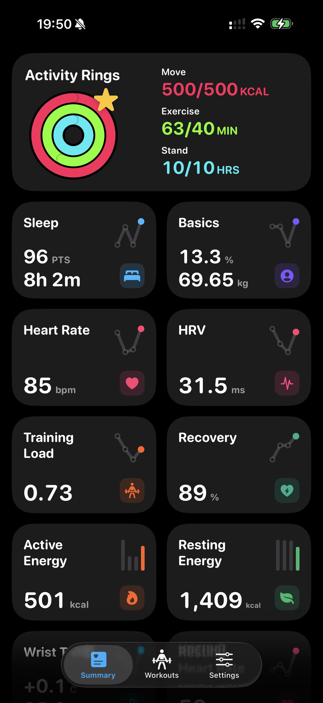
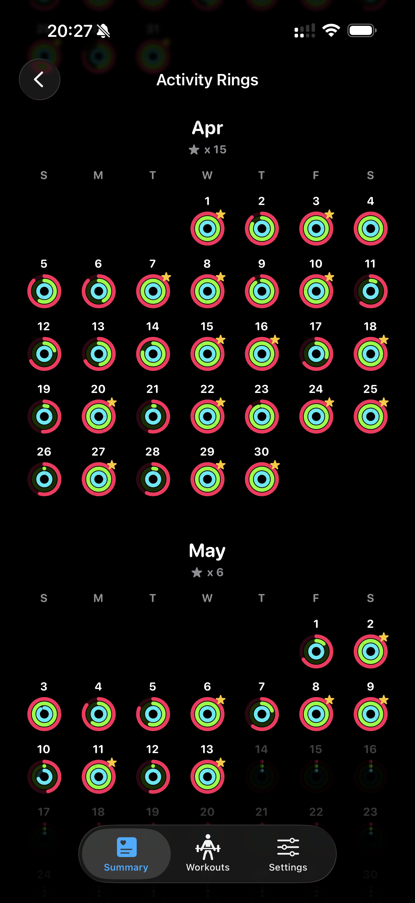
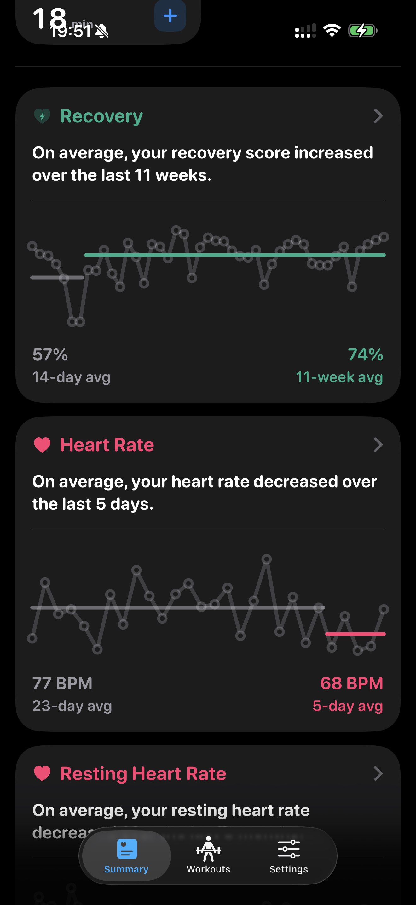

# Body

Workout-associated cumulative steps and distance treat only HealthKit's typed `errorNoData` as an absent value, not zero. Real query failures and cancellation still preserve cached values and block validation; general statistics and permission handling are unchanged.

RP-03 journal repair retries use durable per-month backoff of 5 minutes, 30 minutes, 2 hours, then at most once per 6 hours on subsequent foreground opportunities. Failed or interrupted attempts never clear dirty obligations; other eligible months can proceed. Workout journal lifecycle is enabled in ordinary Debug and Release builds following explicit user approval and iPad repair acceptance; no local compilation override is needed.

RP-03 Phase 5 saves each workout anchor with canonical membership and pending repair intervals atomically; interrupted bootstrap retains the prior generation. The foreground lifecycle repairs months, effort/detail caches, records and dependent dashboard inputs after publication, checkpointing durable work across relaunch. Existing query-derived refreshes, effort validation, and explicit repair remain authoritative; an empty journal delta never certifies score freshness. Physical mutation/relaunch and dependent repair were verified on iPadPro, and the user confirmed correct Home, records and refresh behavior before approving activation. The remaining matched performance baseline is not claimed complete or used to claim a speedup. The opt-in physical mutation harness and its exact-workout cleanup receipt are documented in `TestPlan.md`; ordinary test runs never create a HealthKit workout. Phases 6 and 7 remain deferred.

RP-03 Phase 4 review corrections: overlapping effort reads reuse compatible validation already admitted by a peer without reporting a false failure or overwriting its score or confirmed absence. Unchanged record ledgers do not advance the publication revision or interrupt historical repair. Previously loaded empty months display immediately while stale data revalidates in the background; unknown, cleared, and empty disk-only months retain the loading path.

<p align="center">
  
</p>

Body is a privacy-focused iOS health visualization app built with SwiftUI. It turns Apple Health workouts, Activity Rings, Readiness, sleep, energy, body measurements, daylight, steps, and vitals into a local-first app and widget experience.

Current app version: **1.1.0 (build 9)**

Record-input validation is separate from workout display fallback. A failed associated-distance read preserves the existing record contribution and cannot advance baseline coverage. Successful empty reads remove the obsolete distance/rate values; successful month membership removes only absent workouts in that month. Unrelated effort or heart-data failures do not invalidate record inputs.

Visible workout months revalidate after five minutes on resume or navigation. Validation is separate from `generatedAt`; missing metadata, changed permission/calendar context, and clock rollback mean stale. Historical record and ring repair revisit one old month per eligible pass on the background pool, at least five minutes apart; a completed cycle waits 24 hours. Each cursor is persisted with its repaired payload. Failed or superseded reads do not advance it, and repair completion depends on app activity.

Historical trend reconciliation admits successful leaves independently. A failed comparison or incomplete sleep-vital hydration cannot discard an unrelated primary repair. Changed leaf revisions reject older results, rolling series stay within their documented window, and concurrent intraday inputs and frozen observations remain live. This does not shorten the initial three-bucket publish or change query budgets.

All RefreshOptimizationPlan-03 phases use build 8. Explicit source, grouping, and sleep-parsing edits retain user-initiated refresh scope: authorization prompting when needed, the recent chart months, and scoped workout-effort reconciliation. Rejected dashboard commits release their trend anchor without clearing a newer refresh's anchor.

Permission changes invalidate visible data immediately, then serialize privacy cleanup and cached filtering before corrective refresh. Cleanup holds the refresh slot, overlapping toggles coalesce after all cleanup finishes, and cancelling the Settings caller does not abandon an already-applied opt-out.

Dashboard durability: the versioned dashboard envelope stores ring progress, comparison scope, and cold-start freshness atomically with their payload. Live refresh success does not wait for disk. Legacy snapshots keep their history but restart unproven ring backfill and freshness; main and day-sample sidecar saves report durability independently. A failed save retains the previous file, and a later compatible save can retry the captured data without refetching. Explicit intraday repair supplies per-series authority for successful empty reads.

Background warning admission is rechecked immediately before submission: changed warning settings, source selections, permissions, foreground state, or cancellation stop stale requests. Evaluations do not overlap, and successful submission merges into the latest notification ledger so foreground seeding is preserved. Requests already handed to the system are outside that cancellation guarantee.

Source discovery freshness is separate from dashboard freshness. Explicit dashboard and metric repairs rediscover sources; passive discovery expires after 24 hours or a known write invalidates it. Failed kinds retain their usable maps and retry later. Changed membership invalidates dependent caches and updates watch source expectations, including a successfully discovered empty source set.

Calendar freshness binds recomputable aggregates to their calendar and time zone, and today's summaries to their local day. Midnight invalidation precedes resume freshness gates. Active-app day and time-zone notifications use the same context fence as resume and late-result admission. Raw instants and frozen observations retain their original attribution; historical workout grouping is unchanged. Failed aggregate queries leave incompatible values unavailable until a successful repair.

Ring history now preserves explicit calendar-day identities across travel, including partial-backfill checkpoints. Legacy entries without proven day attribution remain archived on disk and are excluded from dated ring counts until successful reconciliation replaces them. Upgrade restarts unproven backfill once; partial repair resumes from its atomically saved day boundary. Older-month pagination also repairs remaining archived months, at most three per pass. Failed queries or writes do not erase the archived history.

Archive repair remains reachable after ordinary pagination reaches the history start. It preserves that end-of-history decision and prior empty probes; scattered empty repair months count as validated coverage, not a continuous displayed gap. Pending repair keys are cached in memory on history replacement, including initial load, and reused by scroll admission and pagination. No derived repair queue is persisted.

Background warning exits preserve earlier failures: losing submission eligibility reports failure, or partial failure if another warning was already delivered, when an earlier kind failed. With no earlier failure the exit remains skipped. Notification ledger rules are unchanged.

Intraday repair: explicit Heart Rate, HRV, Respiratory Rate, and Blood Oxygen pulls reconcile the full retained sample window; passive reads keep the 48 hour overlap. Successful empty reads clear only their authoritative series on disk, while failed or unqueried series preserve compatible cached data. Memoized hydration and older lazy reads cannot resurrect a newly repaired deletion. Per-series revisions preserve unrelated concurrent loads; stripping incompatible samples also drops their write authority. Hourly Steps and Active Energy reads retain their existing full-window behavior. Effort validation: cached scores and confirmed absences revalidate after 24 hours, with missing timestamps or clock rollback treated as stale. Failed checks retain display values without renewing Training Load summary, series, or watch seed freshness. Explicit Training Load and month pulls retain their repair scope. Visible-month validation, bounded historical record/ring repair, and per-leaf trend reconciliation are described above.

## Screenshots

<p align="center">
  
  
  
</p>

<p align="center">
  
  
  
</p>

## Features

- **Summary tab** - A **Star Metric** hero leads the tab — one metric pinned to the top and rendered chrome-free (no card) on a full-bleed backdrop that bleeds behind the status bar; v1 defaults to **Readiness**, rendering today's readiness score on a wave-fill tinted by the readiness band that fills left-to-right to the score and melts into the page — the big score flips up from zero and the whole hero taps through to the Readiness detail. Choose the star metric, or turn it off, in Settings > Metrics > Star Metric (a new gold row); while Readiness is starred the custom Home Background is auto-disabled (the hero supplies the color). Below the hero, drag-to-reorder health cards for Activity Rings, Exercise Minutes, Skin Temperature, Daylight, Steps, Sleep, Vitals, Basics (body fat/weight/BMI), heart rate, resting heart rate, Training Load, HRV, blood oxygen, respiratory rate, Cardio Fitness, active energy, and resting energy — the starred metric is lifted out of this grid. Reordering slides the cards to their new positions, and a card released somewhere that can't take it — the hero, the space below the grid, the tab bar — animates back into place. Each card includes a four-day preview chart and an About explainer. Detail screens support Week/Month/6 Months/Year ranges. Body reads the **last year** of Apple Health throughout: a metric whose newest reading is older than that shows its empty state on the card and the detail page rather than a headline value its own chart has no room to plot — on iPhone, Apple Watch, and the widgets alike. Heart Rate's and Respiratory Rate's **Day View** carry the same range treatment as their longer-range charts: behind the hourly-average line, each hour draws a translucent gray capsule bar from that hour's lowest to its highest sample. On entry, a metric detail's Day View renders its cached data instantly and refreshes from Apple Health in the background; when fresh data lands or the selected day changes, marks glide to their new positions — the same dot morph the sleep Vitals plot uses — new data fades in, and Reduce Motion disables the chart motion. Tapping a metric card, a trend card, or Activity Rings zooms its detail page out of the card itself (the morph clipped to the card's rounded corners) and collapses it back into the card on dismiss; a grid card and a trend card for the same metric each animate from their own position, and the transition cross-fades under Reduce Motion. The full-bleed Star Metric hero instead **cross-fades** its detail in and out (dismissed with a Back button) — a fade reads better for a hero with no card edges to grow from.
- **Activity Rings** - The Activity Rings card opens a scrolling month calendar of daily ring graphics with per-month header stats (gold star count for fully completed days plus per-ring close counts). A day counts as closed when the displayed whole numbers meet the goal — the completion star and close counts always agree with the "value/goal" numbers shown (a day reading "500/500" is closed even if the raw Health value is 499.6). Press and hold any past day's rings to peek a floating callout with that day's Move/Exercise/Stand values and date; it follows the hold and dismisses on release, and scrolling cancels it. Ring history loads outside the dashboard refresh rather than inside it, so it can never hold a refresh open: once a refresh has finished, a background pass walks up to ten years of daily rings, newest first, in twelve month chunks, publishing each chunk as it lands, so on a first launch the calendar fills in progressively and the app stays usable while it does. The walk remembers its progress (completed, pending with a resume point, or suppressed while Activity access is denied) and resumes instead of restarting, and every ring read, each backfill chunk plus the recent window and the older-history probe, runs as a stoppable query with a 20 second timeout, so a stalled read is cancelled rather than waited on.
- **Trend cards** - Below the health cards, a scrollable stack of trend cards each summarize a metric's recent direction in plain language ("On average, your weight decreased over the last 4 months."), with a comparison chart that draws a gray baseline-average line against a colored recent-average line and labels both period averages. They cover the vital, sleep, and activity metrics (Readiness, heart rate, resting heart rate, HRV, **Cardio Fitness**, respiratory rate, blood oxygen, sleep, skin temperature, steps, active energy, resting energy, exercise minutes, training load, daylight) plus **Weight** and **Body Fat** (weight follows the kg/lb unit setting); the home shows the most significant few with a Show All Trends toggle, and you choose which appear in Settings > Metrics > Trend Cards. The Weight and Body Fat cards also appear on the Basics detail page, each tapping through to its focused metric screen.
- **Add measurements** - The Basics detail screen has an Add (+) button that opens a sheet to log a new weight and/or body-fat reading — chosen with wheel pickers that start from your latest values, with a date/time and an include checkbox per measurement so you can log either or both — saved straight to Apple Health.
- **Rate workout effort** - Tap the Effort card on a workout's detail screen and it expands in place (no popup) to reveal Cancel/Save on the left and − / + buttons on the right; set the rating 1–10 (Easy → All Out) and the triangle effort meter fills to the exact level. The first Save presents the Apple Health write-permission sheet for workout effort; later saves reuse that decision without prompting again. Denying the sheet (or an already-denied category) shows a "Couldn't Save" alert that names the failing step — no second sheet — and resets the Auto-Apply Effort toggle off; the alert's reason comes from Apple Health's own save result, because the per-app status HealthKit reports can disagree with what the Health app shows (devices have reported "denied" while Health showed Full Access). Once permitted, Body saves the rating to Apple Health, relates it to that workout, and recomputes Training Load. Every workout's Effort card shows a **`Body's prediction: N`** estimate (v1) computed from your own baselines — average heart rate against your heart-rate reserve (resting to age-estimated max HR), time in the top heart-rate zones, session duration, and your past ratings for similar workouts — weighing strength/functional-strength/core predictions by peak heart rate and set-to-set HR swings, and snowboarding/downhill-skiing predictions more heavily by duration, falling back to the workout's stats (type, energy rate, speed vs your recent history) when no heart rate was recorded. The prediction shows on unrated and self-logged workouts alike and stays visible after you save a rating, so you can compare it against your own. While its inputs load, the line reads **`Body's prediction: Calculating…`** and the settled number crossfades into place, so the estimate never appears out of nowhere (nor as a provisional number that flips). For workouts you haven't rated yet, opening the editor also pre-fills that predicted value as the starting point; logged workouts open at your saved value. Turn predictions off anytime in Settings > Workouts > Workout Effort > Effort Suggestions (v1, on by default). The same screen's **Effort Card** toggle (on by default) is the master switch: off, the Effort card disappears from every workout detail page and the settings below it — Effort Suggestions and Auto-Apply Effort — grey out and stop doing anything. The same screen has an opt-in **Auto-Apply Effort** toggle (off by default): when on, Body automatically saves its prediction to Apple Health for workouts that arrived unrated — only workouts that ended between about 1 hour and 48 hours ago (the 1-hour wait lets a rating synced from your Apple Watch land first, and nothing older than 2 days is ever touched) and only medium/high-confidence heart-rate-based predictions; sessions without heart rate stay blank for you to rate, and re-rating any workout always overrides Body's value.
- **Energy Equivalent card** - Between Details and Effort on a workout's detail screen, an **Equivalent** card turns the workout's active energy into food emoji — a greedy breakdown over a fixed 28-food kcal table (🍔 550 down to 🍫 50, spanning Asian foods, fruits, and drinks) that draws each pick from a band of similar-kcal foods with a kcal-seeded random generator, so the mix varies between workouts while the same workout always shows the same emoji; capped at 12 emoji, hidden entirely when the workout has no active energy, and breakdowns of only one or two foods get padded with a few zero-kcal 🧊 ice cubes so the card still has something to knock around. The emoji fade in and then tumble around the card as a small physics toy driven by the phone's gyroscope — each food moves at its own weight (heavier foods accelerate harder under tilt, lighter ones damp out sooner) and spins as it rolls rather than staying upright — with light haptic taps on collisions (intensity scaled to impact, rate-limited); the simulation runs only while the card is on screen and the app is active, Reduce Motion swaps it for a static emoji row, and the Simulator (no gyroscope) falls back to plain downward gravity. The card's ⓘ button opens an explanation sheet listing every food and its fixed kcal estimate. Each workout's breakdown is cached in its on-disk detail snapshot and reused until the workout's calories, your food choices, or the representation style change. Settings > Workouts > **Workout Equivalents** (fork-and-knife icon) can turn the **Equivalent Card** off entirely (the workouts-row summary reads On/Off from this switch), offers an **Emoji Size** slider (0.7×–1.3×, default centered at the standard size), turns Collision Vibration off, offers a **Total Energy** switch that represents the workout's total burn (resting energy included) instead of active energy alone, offers a **More Food Items** switch that fills the card with many small foods instead of the fewest large ones (e.g. a pile of small snacks instead of a noodle bowl), and shows/hides individual foods — hiding a food recomputes breakdowns over the remaining ones, so the emoji still roughly sum to the workout's calories.
- **Rename a workout** - Tap a workout detail's title (shown next to a small secondary pencil icon) to open a **Rename Workout** alert with a text field — placeholder is the default type name — and Save/Cancel; the name is trimmed and capped at 60 characters, and saving blank restores the default type name. The custom name is saved device-locally (keyed by the workout's HealthKit UUID, not synced and not shown in widgets or on Apple Watch) and shows on the workout detail hero, the Workouts list rows, and the day/type workout list sheet rows; Workouts search matches it too, alongside the original type name. On the Share page it shows in the **Map** background's classic header — other backgrounds keep showing just the type glyph.
- **Workout route map** - Workouts recorded with GPS show a route behind the top of their detail screen, with the city (e.g. "New York, NY") shown below the workout title. Choose the look in Settings > Workouts > Route Style, a picker sheet styled like the Star Metric picker (icon tile, title, subtitle, checkmark per row) rather than chips, offering four styles in this order: **2D Map** is a flat Apple Maps snapshot with the route drawn fit-to-bounds and **colored by pace** (red slow → green fast) with green start and red end markers; **2D Plain** strokes the route only in the workout type's color on a black background with the same workout-tint fade backdrop routeless workout details use — no start/end dots, no pace coloring, no map tiles; **3D Map** renders a pitched (60°), realistic-elevation Apple Maps snapshot with the 3D Plain elevation ribbon composited on top — a single white line for every route, no pace coloring, no start/end markers, lifted above translucent white walls standing on the map (falling back to the flat white line when too few fixes carry altitude), tilting toward flat on longer routes since MapKit reduces pitch as camera distance grows, and framed to land at the same size and position as the 3D Plain ribbon (Body measures the route in a first snapshot and corrects the camera before taking the final one, so it is anchored like the other styles rather than merely centered); **3D Plain** (default) draws the route as an oblique, north-up elevation ribbon in the workout's tint — a lifted line over translucent tinted walls dropping to a faint ground trace, exaggerated up to 30% of the route's width for 200 m or more of climb, with a flat route still drawn as a raised plank — and needs at least half of the route's fixes to carry altitude, falling back to 2D Plain otherwise; like 2D Plain it has no markers or pace coloring — in 3D Plain you can also **swipe left or right on the route** to rotate the ribbon about its vertical axis (the framing stays the size it rests at and doesn't rescale while you turn it), with VoiceOver Rotate Left/Right actions as an alternative to the gesture. In the anchored styles the route's vertical extent is centered between the top safe area (below the status bar / Dynamic Island) and the top of the distance text, and the hero is a fixed background that dims as the workout details scroll up over it. Tapping the route area (any style) zooms it open into a **full-screen interactive map** — pan and zoom the same pace-colored route with its start/end markers in every style, drawn like Fitness as a thin, slightly translucent 4.5 pt line that keeps that width at every zoom (the route is cut into up to 200 short same-color pieces, each colored by its own mean pace), with the 3D Map style tilting to pitch 60 once the fit resolves — dismissed with a top-right ✕. Indoor or route-less workouts have no map hero, so their detail page opens directly on the stats below it. Opening a GPS workout no longer jumps: Body checks whether the workout has a route before its GPS fixes have loaded, and the page **glides straight into the with-route layout** rather than dropping the stats ~324 pt when the route lands. The route then **draws itself in from start to finish** over about a second in the styles that stroke their own trace — 2D Plain and 3D Plain — while the map styles arrive whole with their snapshot. Reopening a workout whose route is already loaded shows it instantly with no replay, and Reduce Motion skips the draw while keeping the layout steady. Settings > Workouts > Route Style leads with a **Draw Route** switch (on by default) above the style rows; turn it off and the reserved area shows a soft shimmer that cross-fades to the route instead. The draw applies to **2D Plain** and **3D Plain** only — on the map styles the route is composited into the map snapshot rather than stroked, so the switch is greyed out and inert there with the line "Not available with the map styles, which draw their route onto the map." beneath it, and the map styles show the shimmer while they load; your stored preference is left untouched, so picking a plain style again restores it. While the draw is on, the Route Style row summarizes as **`Draw · 3D Plain`**; with it off — or on a map style — the row reads just the style name.
- **Share workout** - A Liquid Glass **Share** capsule button appears top-right of every workout's detail page — route or route-less — immediately, but grayed out and inert until its route fetch settles, then it enables in place (never a pop-in). Tapping it opens a full-screen, Instagram-Story-style preview of a Strava-style share card: a ✕ button top-left closes it, the card fills the safe area letterboxed to its aspect ratio, and a small blue **v6** capsule badge sits beside the "Share" title (same style as the settings sheets' version badges). The page **opens on the Midnight background (pure black)**, default **Portrait 9:16** ratio. A vertical icon rail sits over the trailing (right) edge of the preview — **Font**, **Route Color**, **Route Style**, **Metrics**, **Profile**, **Background**, **Ratio**, **Arrange** — and tapping an icon expands a horizontal tray of that option's tiles out to its left, one tray open at a time; tapping the preview or picking a tile closes the tray. A tray's tile scroller (and the Metrics/Long Image chip strip) fades softly at whichever edge currently has tiles scrolled under it — tiles at rest stay fully opaque, and a faded edge tile is still tappable. **Font** offers Rounded default, Standard, Serif, Monospaced (applies to the card's text; the **ohmybody** wordmark stays Rounded regardless), remembered across shares. **Metrics** chooses which metrics the card shows and is **Body Pro**: for a non-Pro user its rail icon carries a lock badge and tapping it opens the paywall (the card keeps the automatic pick), while a Pro user gets a strip of chips below the preview card (not beside the icon) — one per Details metric the card can render for that workout, plus **Time** and **Distance** — and picks **0 to 5** of them (tapping a chip doesn't close the tray; at 5 the unpicked chips dim, and there is no floor — turning the last chip off leaves the card with no metric blocks at all, just the route and the branding, with the trace recentered into the space the blocks left). Picking a 4th or 5th metric re-lays the card's metrics: 9:16 keeps a single top-to-bottom column (smaller compact blocks, with the route square shrinking to make room); a landscape ratio arranges them as side-by-side rows of 2; the shorter shapes (3:4, 1:1, and the stacked layouts on 16:9/4:3) wrap to two rows and shrink the route square to make room, with 1:1 and stacked landscape falling back to smaller compact metric blocks, while 16:9 stacked keeps a single row of all 5. The pick is remembered **per workout type**, and is a preference rather than a guarantee: a later workout of that type that lacks one of the picked tiles simply drops it, falling back to the automatic pick when none survive, and a Pro lapse falls back the same way without erasing what's stored. On the **Map** card the header already shows Distance and Duration, so the bottom row shows the *other* picks (still up to two), backfilled with the classic extras when the header swallowed every pick — though a pick of none empties that row too. **Profile**, free and hidden by default, shows your Settings › Profile avatar and/or `@nickname` beside the watermark — the avatar and nickname toggle independently, each tile stays disabled until the matching field is set in Settings, and a caption below the preview says so while the tray is open with something missing. A third **Show Separator** tile in the same tray controls the `–` drawn between the **ohmybody** wordmark and your avatar/nickname: on by default, turned off it butts the attribution straight up against the wordmark. It's dimmed and inert while neither the avatar nor the nickname is showing, since there's nothing to separate. **Ratio** offers five card shapes — **Portrait 9:16** (default, free), **Landscape 16:9**, **Portrait 3:4**, **Landscape 4:3**, **Square** — all but 9:16 are **Body Pro**: their tiles carry a lock badge and tapping one opens the paywall for non-Pro users, and if Pro lapses mid-session a stored non-9:16 pick silently falls back to 9:16 for that session without overwriting the stored choice; the pick is remembered across shares. A sixth tile, **Long Image**, also **Body Pro**, switches to a separate mode: a tall, scrollable export of the whole workout — the header and route (or type icon), the selected metric tiles, and their matching detail charts (heart rate, pace/speed and splits, elevation, cadence, power, stride length, ground contact time, vertical oscillation) — on a flat gradient background only; the **Metrics** chips have no five-metric cap while Long Image is active (any number can be on, and unlike the card this mode keeps a floor of one), and a deselected chip hides both its tile and its matching chart section, while chart sections with no matching chip (stride length, ground contact time, vertical oscillation, power, and splits when there's no pace/speed chip) always show when their data exists; the Map, photo, and video **Background** tiles are dimmed and disabled while Long Image is active, with a hint that the long image uses a gradient background; picking a ratio tile switches back to the card layout, and the ratio you had stored is restored. **Arrange**, offered only on a landscape ratio with a route, chooses **Stacked** or **Side by Side** for the centered layout — it's greyed out while the **Map** background is active, since the route there is baked into the map snapshot rather than laid out by the card. For a route workout the rail also carries **Route Color** (Body Blue default, Workout Color, White, Black, Orange, Green, Pink) that colors the card-drawn 2D line and 3D ribbon on the preset/photo backgrounds — it's greyed out while **Map** is selected, since the map keeps its own pace-colored line — also remembered. **Background** offers **2D** and **3D** trays (Midnight, Workout Color, Daylight, Transparent ×2, Map, Your Photo, Your Video in each) — the same six backgrounds with, on 3D, the route drawn as a **3D elevation ribbon**: an oblique ribbon on the gradient presets and photo backgrounds, and on Map the ribbon rises straight up off the actual roads, with the pace-colored line on top and the white-ringed start/end markers sitting on that lifted line. **Daylight** is a pure-white card with dark text and branding — free, like the other two gradient tiles — and the page still **opens on the Midnight background** by default. Two **Transparent** tiles sit after the gradients — one with white text, one with black — and are **Body Pro**: they drop the background *and* the card's top/bottom scrims, so Share and Save produce an image with a real alpha channel for dropping onto a Story, a poster, or a video edit. There are two rather than one because nothing sits behind the text to derive the ink from, so which way it runs is your pick; the preview draws a gray checkerboard behind the card so the transparency is visible, and that checkerboard is never part of the export. **Share** hands over an actual `.png` file and **Save** writes PNG bytes to the photo library, since a JPEG re-encode would flatten the alpha to black. Non-Pro users get a lock badge and the paywall, a Pro lapse falls back to Midnight for the session without overwriting the stored pick, and both tiles are dimmed while **Long Image** is active — that mode always paints a gradient. The **3D** tray is **Body Pro** — its tiles carry a lock badge and tapping one opens the paywall for non-Pro users, and if Pro lapses mid-session a stored 3D pick silently falls back to 2D for that session without overwriting the stored choice. A route without usable elevation data greys the 3D tile out (not tappable) with the line "3D needs a route with elevation data." beneath it. The same tray leads with a free **Hide Route** tile (eye-slash): on a gradient or photo background it drops the trace and renders the metrics-only card, the choice is remembered across sessions, and tapping 2D or 3D again shows the route; on the Map background the tile is greyed out and inert ("Hiding the route doesn't apply to the Map background.") since the map's route is baked into its snapshot. For a route workout, every non-map, non-3D background renders the **headerless centered** card: no type icon, title, locality, or date; the route trace (2D line or 3D ribbon) sits above a centered stack of large metrics — a small label over a big value, Distance then Pace (Speed for speed-based types) then Time, falling back to elevation or avg heart rate when distance/pace is missing (automatic default up to three; a deliberate Pro pick anywhere from none to five), arranged as a column on 9:16, or per the **Arrange** pick (route over a horizontal metrics row, or route beside a metrics column) on the other ratios — with the Body app icon and the **ohmybody** wordmark centered at the bottom; only the **Map** background (2D or 3D) keeps the classic layout: on 2D a pace-colored route with white-ringed start/end markers on a dark map snapshot re-fetched per aspect ratio, on 3D the same map with the ribbon composited on top (loaded when picked, with the classic layout held during the load so there's no flash), a header mirroring the detail page — type icon, title, locality, and date/time on the left, big Distance and Duration numbers on the right — and a bottom-left row of **up to two** per-type extras (avg pace for a run, avg speed for a ride, elevation gain for snow sports, plus avg heart rate when recorded). An indoor or otherwise route-less workout (strength, yoga, HIIT, …) gets the same page with no Route Color or Arrange icon and a single **Background** tray (Midnight, Workout Color, Daylight, the two Transparent tiles, Map is never offered, Your Photo, Your Video) — no 2D/3D split. In the Route Style rail slot, a route-less workout instead shows a free **Icon** row with **Show**/**Hide** tiles that show or hide the workout-type glyph on the card; the choice is remembered across sessions, and hiding the glyph keeps the card's VoiceOver identity by moving the workout type's label onto the metrics block. Every background renders a **route-less** card instead: a small (30 pt) workout-type SF Symbol above a centered stack of metrics (automatic default up to three; a deliberate Pro pick anywhere from none to five) — Distance (when recorded) then Pace/Speed then Time then Active kcal/kJ, falling back to elevation or avg heart rate to fill the stack — with Active Energy omitted entirely when the workout recorded none (never shown as a blank or "No Data" tile); if a Map background was previously remembered from a route workout, a route-less share opens on Midnight instead **without overwriting** that stored choice, so the next route workout you share still opens on Map. Picking a photo from your library as the background requires **Body Pro**, on both route and route-less cards. Picking a photo opens a **Photo** step first — the metrics tray's strip under the preview shows two chips, styled like the metric chips, in place of the metrics picker: **Photo** and **Layout** — where you **drag to move the photo, pinch to zoom (centered anchor), and double-tap to reset it**; the photo always keeps the card covered (pan and zoom are clamped so no edge ever shows), and tapping the **Layout** chip advances to the **Layout** step, today's block drag/pinch/double-tap placement of the route/metrics block, with the same chips to switch back; the Layout step snaps the block onto the card's horizontal and vertical centre like a Story editor, pulling it in once it comes within 5 pt of either axis, with a dashed guide line (white on dark backgrounds, black on light ones) and a light haptic appearing for each axis it's snapped onto while you drag, and the guides never appear in the export; the icon rail stays usable throughout. Both the photo's placement and the block's placement are baked into the export together, and both reset on a new photo pick, on leaving photo mode, or on changing the aspect ratio; a hint caption below the chips explains whichever step you're in, and the current step is preserved if you open and close the Metrics tray. While a photo or video import is in flight, a floating **"Importing media..."** capsule (the app's standard sync badge) appears over the page instead of a spinner on the tile. Picking a video from your library as the background — the **Your Video** background tile, also **Body Pro** — picks a clip from the library and the preview plays the clip muted, looping the first minute behind the card, with the same drag-to-move, pinch-to-zoom, and double-tap-to-reset framing as a photo across the same **Video** / **Layout** chip steps; **Share** and **Save** produce an **MP4** with the card overlay composited onto every frame — first minute only, original audio kept, 30 fps SDR, at the ratio's pixel size (1080×1920, etc.); the clip is session-only, and picking a preset, Map, or photo drops it. Without Pro, the tile shows a lock badge and opens the paywall, and a Pro lapse drops the clip for the session. Your last ratio, arrangement, background pick, and dimension (2D/3D) are remembered the next time you share (photos and videos stay session-only). Top-right, native **Liquid Glass circle buttons** (material circles pre-iOS 26) replace the old capsule bar: **Share** hands the rendered image to the standard iOS share sheet and **Save** writes it straight to your photo library and auto-dismisses the page after a brief checkmark confirmation — export is the card at 3× (1080 px on the short side): 1080×1920 (9:16), 1920×1080 (16:9), 1080×1440 (3:4), 1440×1080 (4:3), or 1080×1080 (square).
- **Share month summary** - A **Share** button sits at the trailing end of the Workouts tab's search row, after Sort, Filter, the search field, and Jump-to-month, and opens the same share composer with the card content replaced by the month's summary chart — the calendar grid or the activity breakdown bars, whichever the page currently shows — under a month title, with **up to 3** pickable totals (or none) drawn from Workouts, Active Days, Time, Active Energy, Distance, Longest, and Top Activity (Body Pro picks up to three, free users get Workouts and Active Days). The title and totals are set smaller than a workout card's metric blocks, so the chart is what the card leads with, and the height they give up goes to the chart. The breakdown bars carry the Workouts page's own type sizes across the card's full content width — starting and ending where the title and totals do — on a slightly leaner row than the page draws. How many bars the card ranks is yours to pick: a **Bars** row of its own sits on the rail directly under Chart Style, present only while Bar Chart is selected, and its numbered tiles offer **1 up to however many activities the month holds**, five by default and remembered across shares (a month with a single activity has nothing to choose, so the row stays away). Picks past what the card's chart region fits are drawn smaller rather than trimmed — bars, labels, icons, and gaps all shrink together, so a twelve-activity month still shows every bar it was asked for. A pick is a preference, not a promise: a leaner month clamps it to its own activity count for that card without overwriting what's stored. The rail offers **Font**, **Chart Style** (switches Calendar/Bar Chart for the share card only, session-only — it never changes the page's own toggle), **Weekdays** (**Show**/**Hide** tiles for the calendar's S M T W T F S row, remembered across sessions; the row is on the rail only while Calendar is selected), **Bars** (the bar chart's row count, above; on the rail only while Bar Chart is selected), **Metrics**, **Profile**, **Background** (Midnight, Workout Color, Daylight gradients, plus the Body Pro Transparent, photo, and video tiles — no Map, since there's no route), and **Ratio** (three shapes — Portrait 9:16, Portrait 3:4, and Square 1:1 — with the same Body Pro gating as a workout card, no landscape shapes and no Long Image; a landscape ratio remembered from a workout share falls back to 9:16 for the session without overwriting the stored pick). Square drops the month title and totals, showing the chart alone, and the **Metrics** rail icon disappears while Square is selected. The chart reflects whatever the search and filters currently show. The search field itself now expands across the whole row while you're typing, fading the four buttons out and back in as focus starts and ends (the keyboard's Done key or scrolling the list ends editing).
- **Activity-aware workout metrics** - A workout's detail card adapts its stat tiles to the activity. For distance-tracking workouts (walks, runs, hikes, rides, swims, and snow sports) the **distance now leads the detail header — a large number above the duration, with a small unit** — instead of sitting in the stat grid. Walks, runs, and hikes add average pace, elevation gain, cadence, and Cardio Fitness (VO₂max); rides add average speed, cadence, and power; swims add pace per 100 m and stroke count. Max heart rate shows wherever heart-rate data exists, on top of the energy and average heart rate every workout shows; workouts without a distance focus (e.g. strength) still show a distance tile when one is recorded. Tiles appear only when the activity and recorded data support them. When recent history exists, each tile shows a compact **`↑12%`** badge above its unit comparing that metric to your **30-day average for the same workout type**, with a single **`vs 30-day avg`** label beside the **Details** heading — direction only, with no good/bad coloring, and `≈0%` when you're on par. It's computed over the 30 days before the workout, and the label beside **Details** always says where that stands: while the history is still loading it reads **`Calculating…`** and the tiles hold a `0%` stand-in whose digits then **roll over** to the real percentages as the label crossfades back to `vs 30-day avg`; when there aren't a few comparable workouts to average it reads **`Not enough history yet`** and each comparable tile settles on a **`--%`** badge instead — the `0%` stand-in appears only while a number is still on its way, never as a settled result, and a dash is honest about having no data where a zero would claim the metric matched the average. A tile can still carry no badge at all when the metric has no comparable value, or when it arrived after the comparison was built (the lazily loaded HR Recovery tile). Below the heart-rate chart, a **time-in-zone breakdown** lists Zones 0–5 by share and bpm range, with the bands set as a percentage of an age-estimated max HR (220 − age) read from Apple Health (falling back to the session's peak HR when no birth date is available). The chart group leads with the **Heart Rate** chart — a smoothed profile line over faint per-sample scatter dots, bracketed by a solid session-average reference line and dashed max/min lines whose values are labeled down the right edge, plotted over a clock-time x-axis, keeping its own min–max header (e.g. "118-162 bpm") and, underneath, the time-in-zone breakdown. When the route carries altitude, an **Elevation** card is drawn in that same line style but *without* the reference lines: the smoothed profile over round-number y ticks labeled down the right edge and an elapsed-time (`HH:mm:ss`) axis, with Ascent and Max Elevation headers. The card order is **Heart Rate**, then **Pace** for walks/runs/hikes (Avg and Best Pace, in min/km or min/mi) or **Speed** for cycling (Avg and Max, in km/h or mph), then **Elevation**, then the rest of the bucketed bar-chart cards. For running, walking, hiking, wheelchair, and cycling workouts with recorded distance, the **Pace**/**Speed** card carries its per-kilometer/mile **splits** underneath its own chart — the way the time-in-zone breakdown sits under the heart-rate chart, rather than as a separate card — each segment with a relative pace bar (shortest for the fastest split, scaled against the complete splits only, so a slow partial tail can fill its own bar but never shrinks the others), its pace (speed for cycling), and average heart rate, the fastest split highlighted in blue and the slowest in red (both considering complete splits only, and neither shown when a workout has just one complete split or every split at the same pace), and a partial final split labeled with its fraction; a workout with splits but too little data for the bar chart shows the splits alone under the card's title. The remaining bar cards are **Cadence** (steps per minute from step counts, or the Apple Watch's recorded pedaling cadence in rpm for cycling), **Power** (W, for runs and rides only — recorded running power from Apple Watch, or a paired cycling power meter — with the usual Avg Power and Max Power headers plus a third **Total Work** (kJ) stat that sits on the same row when it fits and drops to its own row on narrow screens), **Stride Length**, and — for outdoor runs on Apple Watch SE / Series 6 and later — **Ground Contact Time** (ms) and **Vertical Oscillation** (cm or in). The Heart Rate line, the Elevation profile, and the series bars are all tinted by the same teal→red color ramp, keyed to each value's position within the card's own y-axis range (for Pace, a numerically slower — warmer-colored — value reads as effort, matching the comparison badges' higher/lower sense); the Elevation and bucketed cards' y-axis auto-ranges tight around its data (Elevation allows a negative floor) and labels 3–7 round-number ticks along the right edge instead of always starting from zero, stepping down to finer tick values when the data spans only a little so small differences stay readable. Every card in that family shares the same look — Avg/extreme value headers, a bar per ~30-second-or-wider bucket plotted over an `HH:mm:ss` axis — draws its values from Apple Health's source-deduplicated per-bucket statistics over the workout's active (unpaused) time, follows the distance unit setting, hides itself when fewer than three buckets have usable data, and is gated by the Workout Metrics permission (the Heart Rate card itself can still lead the group and show its own "No Heart Rate Data" state when Heart data is absent); the faint stem column beneath each bar is drawn lighter than before. Every chart in the detail sheet — Heart Rate, Elevation, Pace/Speed, Cadence, Stride Length, Ground Contact Time, and Vertical Oscillation — supports **hold-to-scrub callouts**: press for about a third of a second then slide across the chart to drop a rule line at the nearest point (Heart Rate, Elevation) or the touched bucket (the bar cards) — the rule alone, with no dot on the value — and a floating callout showing that value and its time — clock time on Heart Rate, elapsed time everywhere else, and Avg plus Range when a bucket spans a range — matching the Health charts' scrub callouts; the hold doesn't block the sheet's normal scrolling, and VoiceOver users can step through the points or buckets with the adjustable action. The workout's recorded **weather** shows on its own hero row below the locality, rather than as a Details tile: the temperature (e.g. "21°C", following the temperature unit setting) and, beside it, the recorded humidity. The temperature's icon is the sky condition Apple Health recorded with the workout — sun, cloud, rain, snow, and so on — and when the recording source wrote no condition (which is most workouts) it is a thermometer graded by the reading itself, from a snowflake on a freezing session through to a sun on a hot one. The hero's date line now reads as **date, weekday, time** (e.g. `Nov 14, Fri, 9:41 AM`). The Details tile grid keeps an **Avg METs** tile read from the workout's recorded METs metadata (humidity has no tile — it shows only on the hero's weather row), and, when Apple Watch recorded a one-minute heart-rate recovery reading, an **HR Recovery** tile gated by the Heart permission; both carry the same 30-day comparison badge as the other metric tiles. HR Recovery is read from the workout's attached HealthKit statistics when Apple Watch recorded them at sync time, falling back to a lazy on-demand read for the currently open workout when the statistics aren't attached yet. A **`questionmark.circle`** button at the trailing edge of the **Details** heading opens an **About These Details** sheet at half height, draggable to full and dismissed by its grabber rather than a Done button: a short opening paragraph on what the tiles are and which values Body works out itself (pace, speed, and cadence are derived from the distance, duration, and counts Apple Health stored), a paragraph explaining the comparison badges and each of their `↑12%` / `0%` / `--%` states, and then a one or two sentence explanation of every tile **that workout actually shows** — so a swim reads about swim pace and strokes, never cycling cadence. A heart-rate-recovery read that lands while the sheet is open flows into it rather than waiting for a reopen. Settings > Data > **Clear Cache** also drops the per-workout route, splits, series, and HR-recovery caches alongside the existing dashboard/day-sample caches. For workouts that ended more than a day ago, within the six months the workout list persists (the current month and the five before it), the loaded route with its city label, the chart series, and HR Recovery are also **saved to disk**, so reopening those details after a relaunch renders them instantly without re-querying HealthKit or re-running the reverse geocode; only real data is ever persisted — a "no data" result is never frozen to disk, so it can still self-heal on a later read — the files are stripped when their matching permission is turned off, excluded from device backups, counted in the Settings cache size, pruned as workouts leave that six-month window, and removed by Clear Cache. Splits are persisted too, downsampled first by merging adjacent distance/step samples (exact totals kept, so split distances and cadence stay accurate; merges never cross a recorded pause or a watch split boundary) and capped so a single workout's file stays under ~180 KB — a rare workout whose data can't be capped without losing fidelity simply stays a live read. Splits are only written while Workout Metrics is on, and turning it off removes the persisted splits and chart series outright, so re-enabling recovers everything with a fresh read.
- **Personal record badges** - Body tracks all-time per-workout-type records — best pace/speed, longest duration/distance, and highest elevation — and marks the workout that holds each one with a trophy.fill "PR" capsule on the detail sheet's stat tiles, a bare trophy glyph on workout list rows, and a pill on share cards (not monthly-summary cards). When a newer workout beats a record, the old holder keeps its badge in a dimmed neutral gray while the new holder takes the gold one; share cards only ever show a record still held. Badges fade in rather than pop in as the ledger settles. The workout filter sheet adds a Records section above the type list, narrowing the month to workouts holding current records, former records, or both. A metric needs at least 4 comparable same-type workouts before any PR badge appears; the baseline history scan runs once in the background after your first refresh, and Settings > Cache > Clear Cache resets it so it re-scans on the next refresh.
- **Readiness** - Readiness score based on personal baselines for sleep, heart, training load, respiratory, blood oxygen, and skin temperature signals, with status bands, component scores, confidence, and driver explanations. Today's live score also **drops after workouts** — scaled by the activity's type, effort, and metrics (duration, heart rate, energy) — accumulating across the day and resetting the next morning. When a workout has drained today's score, the hero's one-line explanation **names the workout as the cause** rather than reading the dip as under-recovery: a drop into a lower band is framed as earned training fatigue, while a lighter activity that holds the band is called out as just that (the status still reflecting your recovery signals). The value saved to the **Week / Month / 6 Months / Year history is frozen ~10 minutes after wake** (or after 10:00 when no sleep is tracked), so the activity drop and other later same-day changes are display-only and never alter recorded history. If that morning freeze captured a score before today's sleep had synced from Apple Health, the frozen "started the day with" value upgrades once, same-day, as soon as sleep data arrives — then stays pinned for the rest of the day. The Readiness detail also has a **day view** (on by default; toggleable per metric in Settings > Metrics > Day View), sitting below the days-by-status chart (the About your score card now sits at the bottom of the page, just above the About Readiness card): a date-tile day picker (last 30 days; the 3 most recent free, older days with Body Pro), a Day View line chart tracing that day's score from the morning value down through each workout — workouts drawn as tinted bands with their icons — and an **Impact by Activity** card listing each workout's readiness drop (e.g. "-8%"). A **`questionmark.circle`** button at the trailing edge of that card's heading (readiness only) opens an **About Impact by Activity** sheet at half height, draggable to full and dismissed by its grabber rather than a Done button, in five cards: what the rows are, why the listed drops can add up to more than the readiness the day started with (readiness stops falling one for one as it nears the bottom of the scale, easing down below roughly 5% rather than dropping straight to zero), what makes one session weigh more than another (length, effort, and how demanding the activity is), that one day's total drop is limited and each row is credited only the share its own session moved, and that the drop applies to today's live score alone and never rewrites the trend charts' frozen morning value. The copy stays behavioural: it describes what the user sees, never the weights, caps, or step sizes behind it. The line is derived from a morning score plus its workouts (a workout-free day is a flat line): today uses the live tile's score and its current wake-cycle workout window (matching the tile's endpoint exactly, including a workout that started before midnight carried in from a late wake), while past days use the frozen morning record and the calendar day's workouts. On the Week trend chart, an 80%-opacity dot in the line's color additionally marks **today's current (post-workout) readiness** below the plotted morning point — only on today, and only when a workout visibly lowered the score — and while nothing is scrubbed the highlighted status band follows that dot, so the band reads the current status (scrubbing retargets the band to the touched day and hides the dot until release — hiding it, whether by a scrub or a range switch, sends it climbing into the morning point above it as it fades, and it drops back out of that point when it returns). On the Summary hero, that authored one-liner can be replaced by an **Apple Intelligence** comment: Body hands the on-device system language model a rewrite brief rather than raw data — its own authored explanation for today as the **reference comment**, plus what's below usual (each flagged signal in plain words, and whether today's workouts noticeably or slightly drained the score) and Body's training verdict and advice for the band — never any number, since the score is already on the hero. The model only rewords the reference, keeping its cause and advice: one or two sentences in the authored explanations' voice, naming every below-usual signal and giving advice that matches the verdict (Prime/High/Moderate train, Low/Poor rest or go easy), in the device's language, led inline by the Apple Intelligence glyph and read aloud as part of the hero's VoiceOver label. Comments are plain sentences only: a reply that echoes the brief back, or uses a dash or semicolon, is rejected in favor of the authored line, and a **3-second press-and-hold on the comment** regenerates it. While the model writes, the hero shows a **Generating comment…** placeholder instead of flashing the authored line, with an Apple Intelligence-style **multicolor glow wave** (blue, purple, pink, orange) sweeping across the glyph and placeholder on repeat while the glyph itself slowly spins; the finished comment gets one sweep as it lands, then settles to plain text. The first comment generated after the hero appears (cold launch, or the Summary tab's first appearance) simply appears in place with no crossfade or movement; every later change of the slot crossfades, and the wave is skipped under Reduce Motion. It regenerates only when the readiness state actually changes — a new score, a workout drain, a day rollover, or a language change — and the last comment is cached so a relaunch shows it immediately (Clear Cache purges it). Everything runs on device; no health data leaves the phone. It needs **iOS 26 or later with Apple Intelligence enabled** in a supported language, defaults to **On** where that's available, and falls back to Body's authored explanation whenever it's off, unavailable, or a generation fails.
- **Stress** - A Garmin-style **0-100 stress level** built from heart rate and heart rate variability against your own baseline: an intraday curve in 15-minute windows (Home card, trend card, and a detail day view) plus a daily average with a Peace/Relaxed/Engaged/Stressed band breakdown shown as rows beneath the day plot, alongside an Activity row for the masked movement time. Workouts and active stretches are masked out rather than scored — movement drives heart rate on its own — and stretches without enough heart rate data show as a chart gap instead of counting as calm. The HRV side prefers beat-to-beat **RMSSD** computed from Apple Watch's raw heartbeat series, falling back automatically to the coarser SDNN metric when heartbeat-series data isn't available (e.g. the Simulator). It takes about **two weeks** of data to learn your personal baseline before any level appears — until then the card reads Calibrating. Stress rides the same **Heart** permission as Heart Rate and HRV, so no separate toggle is needed, though existing users are re-prompted once for the new beat-to-beat heartbeat data. It's an estimate of physiological arousal, not a measure of psychological stress or a diagnosis. Stress's dependencies (heart rate, HRV, sleep, steps, active energy) are fetched only as scoring inputs when their own card isn't otherwise on the dashboard: the refresh skips their full year card payload (summary headline, warnings, secondary comparison series) and, for sleep, clamps the query to the most recent 100 days instead of the full year — still enough to keep Readiness's and Sleep's own recent scores unaffected, since both use a 56-day vitals baseline. A layout with only the Stress card on, and no Heart Rate/Steps/Active Energy cards, therefore shows no year trend or headline for those three on the Home cards, widgets, or detail pages until their own card is turned back on.
- **Body Radar (Beta v1)** - A phone-only card watching five overnight signals, sleeping heart rate, respiratory rate, wrist temperature, HRV, and inactive time, against your own baseline, reporting **Typical / Minor / Major** on the Home card, and **No signs / Minor signs / Major signs** on its detail page, the morning after each night's sleep, or Calibrating while it learns your baseline (about 14 nights) or Missing sleep on a night with no real sleep recorded. The card's preview is a Vitals-style set of stacked regions with one ring for the latest night, resting in the region that night landed in. The Home card and detail page use the icon `person.and.background.dotted` in gray with a Beta v1 chip; the detail page mirrors the Vitals page, with Major, Minor, and None bands stacked top to bottom and one dot per night colored by its verdict (red Major, pink Minor, gray None), with no band labels; press and hold the chart to read a night's verdict and the signals it flagged. The score is computed once, at wake plus 10 minutes (or 10:00 with no recorded wake time), and stays frozen for the rest of the day, so a later refresh or a nap never changes today's result. Major signs need strong evidence across at least two flagged signals, so a single signal spiking alone reads as Minor at most. A device without an Apple Watch capable of wrist temperature or respiratory rate still scores from its remaining signals, just less likely to reach Major. Inactive time carries the least weight and is masked on any day with a workout, to avoid confusing a rest day for an early symptom. Body Radar needs the **Sleep** permission, is on by default for new installs, and is turned on once automatically for existing users. It is not a medical device and does not diagnose conditions.
- **Training Load** - The Training Load detail plots your acute/chronic ratio with the current interval band highlighted behind the line (Resting / Optimal / Medium Injury Risk / High Injury Risk) and a days-by-interval breakdown below the value. At the bottom of the page, just above the About Training Load card, an **About your interval** card lists every interval with its ratio range and a one-line explanation — styled like Readiness's About your score card — and chips the interval you're currently in; scrubbing the trend chart moves that Current chip (and the chart's band) to the touched day.
- **Cardio Fitness** - A **Cardio Fitness** card in the Summary grid reads your latest VO₂ max estimate from Apple Health and leads with the reading itself (`40.1` over `VO₂ max`), like every other numeric card. Its preview draws the four levels — **Low**, **Below Average**, **Above Average**, **High** — as four equal stacked rows (High at the top), tinting the row you're in and resting a single ring at your reading's place inside that row, so the level is carried by the ring rather than by words that would truncate at card width; the tint and the ring glide when a new reading moves you, and rows stay a fixed height so the card never lurches as the level changes. The detail page keeps the hero numeric (`40.1` over `VO₂ max`) — the level name belongs to the band — and shades your level's range behind the trend line the way Training Load shades its interval, with a **Days by Level** breakdown under the chart and, at the bottom just above the About Cardio Fitness card, an **About your level** card listing all four levels with their VO₂ max spans (`< 30.2`, `30.2-37.8`, … `≥ 45.0`) and a one-line explanation, chipping the level you're currently in; scrubbing the trend chart moves that Current chip and the shaded band to the touched reading. Levels compare you against people of the same age and sex using normative percentiles from the FRIEND registry (Kaminsky et al., *Mayo Clin Proc* 2015), cut at the 20th percentile for Low, the **median** for Above Average, and the 75th for High. The median and 75th are published FRIEND values used verbatim; only the 20th is interpolated, and it is the one boundary Apple documents (its whitepaper puts the low-cardio-fitness threshold at the lowest quintile for sex and age). Apple names the four levels but does not publish the other cutoffs, so the numbers land close to but not exactly on the Health app's. Classification is available for ages 20 through 79 only: without a date of birth and biological sex in the Health app, or outside that span, the chart still draws but no band, level name, or Current chip appears, and the About your level card says why. The card keeps its VO₂ max reading in that case, since only the level is missing, and its four rows sit dimmed with no ring. Those rows are dimmed two ways: the brighter skeleton wash while a refresh is running and could still classify the reading, and a fainter settled wash once nothing is in flight, so a card that cannot be classified reads as a card with no level rather than one still loading. Because Apple Watch records one estimate after a qualifying **Outdoor Walk**, **Outdoor Run**, or **Hike** — not continuously, and never from indoor or gym-equipment workouts — this is the one metric whose chart plots each reading on its own measurement date instead of averaging readings into the range's buckets, so the **Week** range is often legitimately empty and the About card explains the cadence. Toggle the read in Settings > Data > Permissions > **Cardio Fitness**, which requests VO₂ max plus the biological sex and date of birth the levels are indexed by. A **Cardio Fitness** trend card joins the other trend cards on Summary and repeats at the bottom of the detail page, reading "On average, your cardio fitness increased over the last 6 weeks." above the usual baseline-vs-recent comparison chart, with both averages labelled `40.1 VO₂ max`. Because readings arrive days or weeks apart, this is the one trend card that asks for three *readings* on each side of the comparison rather than the days-with-data every other metric requires — under the shared rule even a once-a-week runner could never accumulate enough days to see it. Turn it off in Settings > Metrics > Trend Cards. Fresh installs get both cards by default; existing users have them enabled once automatically — the permission only for those who already had both **Workouts** and **Workout Metrics** on (so nothing new is read without prior consent), and the two cards appended once to a customized Summary Cards and Trend Cards list (each on its own one-time flag, since the two lists are stored separately) — after which turning any of them back off sticks for good. Cardio Fitness has no Home Screen widget and no Apple Watch surface.
- **Metric warnings** - Low Heart Rate (< 40 bpm), High Heart Rate (> zone-3 lower bound outside workouts and a 30-min recovery grace after them) and Low Blood Oxygen (< 90%): any such reading today shows a yellow warning glyph — which fades in and out — on the metric's Home card and a warning card (start time + short animated chart with the threshold line, scrubbable for any reading's time and value) on its detail page for the selected day; each warning can be switched off in Settings > Metrics > Warnings, and its threshold is editable there too — a value pill opens a wheel-picker popover with a "Use Default" reset; the picked value applies once you close the popover, and "Use Default" applies immediately. High Heart Rate's default threshold is the lower bound of heart-rate zone 3 (70% of your estimated max heart rate, computed from your Apple Health date of birth), falling back to a flat 120 bpm without a birth date on file. A **Notify Me** toggle at the top of the Warnings sheet (Settings > Metrics > Warnings) opts into local notifications for the enabled warnings; turning it on requests notification permission (alert + sound) and flips back off with a hint if you deny it, and turning it off cancels any pending background check. While it's on, Body periodically checks for new warnings in the background (a BGAppRefresh task, at most every 30 minutes and only when Body isn't already open), posting at most one notification per warning kind per day — so it's not real-time, and a warning you already saw on screen in the app that day won't notify again in the background. A failed check or a locked device posts nothing. When Readiness is your starred Home metric, those same badges also line up in a row to the right of the readiness level headline on the hero — up to three, one each for Heart Rate, Blood Oxygen and Body Radar — each drawn in the exact glyph and tint its own Home card shows, since the hero reads the finished card models rather than re-deriving anything (Body Radar's badge is orange for Minor signs and red for Major signs, and because it is its own verdict rather than a HealthKit threshold reading it isn't gated by the per-kind Warnings toggles). A badge only appears while its card is actually shown on Home, so turning the Heart Rate card off in the Home card settings removes its hero badge too, and Heart Rate contributes a single badge even when both the low and high heart rate warnings fired. Tapping a badge scrolls Home down to that card and gives it a brief glow instead of opening the Readiness detail, while tapping the hero anywhere else still opens the detail as before, and once you scroll far enough that the hero fades out the badges stop responding along with it; each badge is a real button for VoiceOver, labelled with the metric's name (Body Radar uses its verdict word). The hero badges have their own switch, Settings > Metrics > Warnings > **Show on Readiness** ("Add warning signs next to the readiness level"), on by default, which affects only the hero and never the card glyphs or the detail page cards.
- **Two-source comparison** - Supported metrics (Sleep, Heart Rate, Resting Heart Rate, HRV, Blood Oxygen, Steps, Active Energy, Resting Energy, Exercise Minutes) can overlay a secondary Apple Health source alongside the primary. Primary and secondary share x-axis buckets, the legend lists each source's average, and the picker hides whichever source is already in use as the other slot to prevent duplicate series. The data source picker rows show **brand-category icons** — smart rings, WHOOP bands, third-party watches/bands, Apple Watch, iPhone/Health, scales, CGMs, and fitness/nutrition apps each get a matching SF Symbol chosen from the source's name and bundle identifier, and unmatched sources fall back to a role-based icon (primary vs. secondary).
- **Custom data sources** (Body Pro) - Settings > Data > Source has a **Custom Sources** section where you can merge several Apple Health sources into one selectable source — two Apple Watches with different names, a watch plus a chest strap, whatever combination you actually treat as one. **New Custom Source** opens an editor to name it and tick at least two of the discovered sources (up to 5 custom sources); saving refetches the affected charts. A custom source carries a user-picked icon — chosen from the same built-in icon set used for detected sources, defaulting to the **heart icon** until you pick one — wherever sources are listed, and can be picked anywhere any other source can — the Settings defaults and each metric's own picker, as the primary source or the secondary comparison. Renaming one or changing its icon updates everywhere instantly without touching a single chart (the merge itself is unchanged), and deleting one falls its selections back to All Sources. The group definitions ship to the **Apple Watch** in the compute seed, so the watch's on-device recompute merges the same sources the iPhone does — members that watch can't see are simply left out of the merge. If Body Pro lapses, custom sources stop filtering — every screen (and the watch) reads All Sources again — but the sources you built are kept, and reselect themselves the moment Pro is back.
- **Workouts tab** - When a workout arrives while the page is open — an app-foreground sync, a pull-to-refresh, or a month finishing its first load — the new card **fades in** and the cards around it glide to their new places instead of jumping; the same fade plays for rows entering or leaving as you search or filter (a re-sort keeps its own re-order animation), and Reduce Motion swaps everything instantly. Searchable workout history with month browsing (swipe the month carousel, optionally swipe the chart card itself — Settings > Workouts > **Others** > **Month Swipe** (arrow.left.arrow.right icon, on by default) makes a clearly horizontal left/right swipe on the calendar or type-breakdown card jump to the next/previous month within the picker's reachable range, without disturbing vertical scrolling or pull-to-refresh, or tap the calendar button beside the search bar to open a popover with a single wheel of the reachable months and jump to any of them with its confirm button; when a new month begins, the page follows it automatically — showing the new, possibly still-empty month — unless you were deliberately browsing an older month. In English, that same Others sheet also offers **Short Month Names** (off by default), which shows the month carousel and the month picker popover's rows as uppercase short names like "SEP" and "SEP 2026" instead of "September" and "September 2026"), sort, type filters, and a single chart card above the list that shows **either** an in-app workout calendar **or** a workout type breakdown with monthly totals — never both at once. A small button in the card's bottom-right corner switches between them: on the calendar it takes the last cell of the final week row, dropping onto a row of its own when the month fills that row exactly; on the breakdown it sits at the end of the last bar's row, which gives up a little of its bar length to make room rather than crowding the activity name. The calendar shows by default, the two cards cross-fade into each other, and your pick is remembered across launches. The type filter and search narrow the whole page together — the workout cards, the calendar chart, the type breakdown bars, and the monthly totals all show only the matching workouts, and tapping a calendar day or breakdown row opens a popup listing just those workouts. Tapping a workout zooms its detail out of the card you tapped (the morph clipped to the card's rounded corners) and opens it as a full-bleed page with the bottom tab bar still visible — closed with a top-right Liquid Glass ✕ and collapsing back into the card; the calendar-day and workout-type popups open the same detail from their rows. Every workout detail page, from either entry path, also carries a glass-circle **Back** button top-left — the mirror of the Share button's chrome top-right — that returns you the same way you came in. The morph falls back to a cross-fade under Reduce Motion. Each workout is filed under the day it happened in the time zone the iPhone was in at the time, read from a ledger of the device's own time-zone changes, so flying home does not move yesterday's evening run onto another day; a workout the resolved zone would push outside the month being shown keeps the current zone's day, and workouts recorded before the ledger's first entry keep the current zone's day too. Each workout's date and time in the list, and in the popup a calendar day opens, are shown in that same zone, so a row never names a different day than the day it is filed under.
- **Sleep detail** - Today's sleep score (now **v3** — Deep is weighted 10 points and Vitals 15, and the Vitals category grades sleeping heart rate, respiratory rate, and blood oxygen against the same robust typical bands as the Vitals chart once about 14 nights of history exist: heart rate and respiratory rate deduct on both high and low outliers, blood oxygen on the low side only with the absolute clinical 92–96% ramp kept as a ceiling, and with less history the previous grading applies unchanged), stage timeline, and a tappable stage breakdown that shows an optimal-range bar chart by default (each stage's percentage of time in bed and duration, with a healthy reference band) and flips to per-stage durations on tap; both views also show a **Restorative** total (Deep + REM combined) — the duration view adds a Restorative duration line, and the bar chart adds a Restorative bar with its own optimal-range band, percentage, and duration — explained by an About Restorative Sleep card. Plus a Sleep Consistency card with a 14-day consistency percentage — each night is scored (and the chart's offsets are computed) in the time zone it was slept in — from per-sample HealthKit metadata, or a ledger of device time-zone changes for sources that don't record it — so travel doesn't tank the score: short trips keep it, longer stays drop the category until the baseline catches up, and a uniformly-shifted night with unknown zones is treated as a zone shift rather than penalized; the chart and the sleep score's Consistency category both read bed/wake times from only the day's main sleep session (the longest session of the wake day), so a daytime nap no longer stretches a night's bar, skews its averages/percentage, or reads as a wake time, and the score's Continuity category likewise grades sleep efficiency over the main session only, so a nap never inflates it — the Apple-style Sleep Vitals chart, and range trend chart. The stage timeline card also shows only the main session (total sleep duration elsewhere — hero value, date tile, sleep score, trend — still includes naps); on a day with naps, a **Nap Stages** card appears directly below it in the same style, combining every nap into one hypnogram (nap start/end times read off the chart's x-axis) with the total nap duration in its header, but no stage-summary stats or optimal-ranges toggle; the card is absent on nap-free days. The Home Screen Sleep Stages widget mirrors the same main-session-only hypnogram, and the Heart Rate, HRV, Active Energy, Steps, and Readiness Day View charts shade the night and each nap as separate sleep bands (nap bands get a moon icon) rather than one block from bedtime to the nap's end — the Heart Rate/HRV "Sleep" activity-average row likewise averages over the night only. The breakdown choice persists until you tap again. Settings ▸ Metrics ▸ Sleep sets the sleep-duration goal plus two Sleep Stages display options — **Show Awake Under 1 Min** and **Show Awake at Start & End** (both on by default); turning **Show Awake at Start & End** off drops the leading and trailing Awake segments (time in bed before sleep and after waking) so the stage chart, Awake stat, and sleep/readiness scores start and end on real sleep, while interior (mid-night) wake is always kept.
- **Vitals** - An Apple-Health-style **Vitals** card sits in the Summary grid right after Sleep, reviewing five overnight vitals — sleeping heart rate, respiratory rate, skin temperature, blood oxygen, and sleep duration (no HRV) — against a personal typical range learned from your own nights (median ± 2× a robust spread, with per-vital floors; needs about two weeks — 14 nights — of sleep data to calibrate). The card shows a "Typical" or "N Outliers" headline and a five-dot hollow-ring mini preview (blue in-range, dark purple for a high outlier, light pink for a low outlier). The preview's three stacked regions — High, the typical band, Low — **share its height by where the rings actually sit**, so the space goes where the data is: rings in all three regions split the height evenly, rings in two share it while the empty region stays a thin minimum, and a night whose rings all land in one region gives that region the tall slot (the old fixed layout). Before the night's vitals are in, that preview holds its shape as a **pending skeleton** — the same three regions, dimmed and equal height, with five gray rings resting in the middle band — and when the assessment lands the band takes its color, the three regions morph to their new proportions, and each ring glides to the region it belongs in, all in one motion rather than the chart popping into existence. That skeleton only stands while a refresh is actually running; with no assessment and nothing in flight the five gray rings go and the three regions stay on their own at a fainter wash, so the card keeps its height and reads as a night with no vitals rather than one still loading. Its detail page has the usual Week/Month/6 Months/Year range selector (Pro-locked beyond Week) leading with a bucketed outlier-deviation bar hero — one continuous gradient bar per bucket, blue through the typical band blending to vivid purple toward High and pink toward Low (no more red; the smallest mark renders as a circle, and an outlier tip is stretched to a minimum visible length), with no y-axis labels — the highlighted typical band is the reference — and a scrub callout (purple/pink outlier dots) listing that period's outlier vitals. Below the hero, a single merged "Day View" card combines the typical-range scatter (purple/pink outlier dots that glide and cross-fade when switching days) with a per-vital breakdown — adaptive row icons and translucent tiles (white in dark appearance, black in light appearance), no Low/Typical/High chips, and outlier readings tinted purple (high) or pink (low) — plus a date picker (free tier: the last 3 days, older nights need Body Pro) to review any recent night's vitals, followed by an About Vitals card. Vitals is derived entirely from existing sleep data (no new HealthKit read types), so refreshing it — even with the Sleep card itself turned off — still fetches sleep data; unlike other metrics, Vitals has no trend card in Settings > Metrics > Trend Cards. Vitals is on by default for fresh installs; existing users with a customized Summary Cards selection need to enable it manually in Settings > Metrics > Summary Cards.
- **Health sync status badge** - A floating sync status badge appears top-center of the screen whenever a HealthKit refresh runs: an animated white 3×3 pixel-grid loader (nine faint pixel cells light up and fade in one of 17 randomly chosen patterns, with a soft glow; Reduce Motion falls back to the standard spinner) next to a label naming the phase the refresh is actually in: "Checking Health access..." while the Apple Health permission sheet may be up, "Loading data..." during the HealthKit reads, "Calculating scores..." while readiness and stress recompute, "Saving workout effort..." while Auto-Apply Effort writes effort back to Apple Health, and "Finishing up..." for the tail. Each phase stays on screen for at least 0.5 seconds, so a phase that flies past is still readable and the label never snaps backwards. Then briefly a checkmark confirmation "Health data updated" (shown only when the refresh actually succeeded) before auto-dismissing. It uses Liquid Glass on iOS 26 and the translucent pill-tab-bar material recipe on iOS 18, and replaces the old full-screen pull-to-refresh loading overlay on Summary, Workouts, and metric detail pages — where pull-to-refresh now uses a custom pull gesture with no system refresh control, so no system spinner ever appears and the badge is the only refresh UI; the Workouts month-switch load now shows a matching floating "Loading data…" capsule too — the old full-screen dimming overlay is removed entirely.
- **Tinted glass sheets** - On iOS 26 every sheet the app presents lays a half-opacity black wash over the system Liquid Glass, so what's behind stays blurred and faintly visible but is firmly dimmed back and the sheet reads as its own dark layer rather than transparent glass. Below iOS 26, which has no glass to tint, sheets keep their opaque background. The workout detail and Share backdrops are the exception — they already carry their own workout-tint→black gradient.
- **Widgets** - Five Home Screen widgets, all **Body Pro** (without it each shows a locked placeholder): **Workout Calendar** (large — monthly tiles using SF workout icons, with star/moon/sun count markers), **Workout Types** (medium or large — percentage-bar breakdown by type), **Health Metric** (small — a chosen metric's current value and recent trend), **Health Trend** (medium — a chosen metric's weekly or monthly trend), and **Sleep Stages** (medium — today's hypnogram, mirroring the app's main-session-only stage timeline). Live widgets always show the actual current month — at a month boundary they flip to the new (still-empty) month instead of holding last month's data. System, Black, and White background choices; System follows the device appearance (white background in light mode, black in dark), while Black and White stay fixed. Alongside them, one **Lock Screen** widget: **Weekly Workout Time** (rectangular, also **Body Pro**), a header reading the total minutes for the rolling last 7 days over seven full-width daily bars with today rightmost and single-letter weekday labels underneath, so the window and the labels rotate with the date. Each bar sums that day's Apple Health workouts (every HKWorkout, counted toward the day it started), with no bar at all on a rest day; this is total workout time, not activity ring Apple Exercise Minutes. The layout fills the whole rectangular slot edge to edge, and Lock Screen widgets render in vibrant monochrome, so the bars take the wallpaper's tint rather than a Body color; without Pro the widget shows a compact lock placeholder. It reads the same cached workout snapshot as the app and is gated on the Workouts permission rather than any dashboard card.
- **Render-cost hygiene** - The busiest screens cache what they derive from your data: metric detail pages memoize workout day slices and per-range chart points and keep chart scrubbing off the page body, Summary builds its trend cards once per render and sizes metric cards from the page width (correct under iPad Split View, and the page follows the window as a Stage Manager window is resized), the sleep hypnogram swaps same-night refreshes in place, the workout heart-rate chart caps its scatter dots at 300, and the share sheet caps cached map snapshots, yields before a long export so its spinner shows, and restarts its map load when the tint changes.
- **Apple Watch** - A companion watch app shows Readiness, Sleep, Heart Rate, HRV, Resting Heart Rate, Training Load, and Skin Temperature in the iOS card style, plus a ring-style complication for each metric (accessory circular, rectangular, and corner). One more complication, **Weekly Workout Time** (rectangular only), is **free**, no Body Pro needed: a header with the total for the rolling last 7 days over seven daily bars, today rightmost, with weekday letters underneath, each bar summing that day's Apple Health workouts (every HKWorkout, counted toward the day it started) rather than activity ring Apple Exercise Minutes, with no bar at all on a rest day. It is complication-only, with no matching card in the watch app, so tapping it opens the Training Load detail page, which carries this same weekly chart below its value; its bars are RGB(1, 47, 167) in the Smart Stack and on full-color faces; tinted watch faces recolor them to the face tint, like every other Body complication. It normally draws from the snapshot the iPhone pushes, gated on the Workouts permission, but can also refresh its bars from the watch's own local on-watch compute like the other complications. A second free, complication-only, rectangular-only complication, **Sleep Stages**, mirrors the iPhone Sleep Stages widget: a header with the total time asleep (REM plus Core plus Deep) for the night, one full-width bar whose segments are colored per stage for the main sleep session only with naps excluded, and a row underneath showing just the night's bed time on the left and wake time on the right. Tapping it opens the Sleep detail page, tinted watch faces recolor the bar to the face tint, and it refreshes from the same phone push or on-watch compute as the other complications; after midnight, before tonight's sleep data has synced, it reads "No sleep data yet" until the next refresh brings it in. The complication picker lists Weekly Workout Time first and Sleep Stages second, ahead of the metric rings. The home screen leads with Training Load, and the watch's Settings screen has a show/hide toggle for each metric so you can choose which cards appear (a watch-local preference — hidden metrics stay synced and can be turned back on). Tapping a card — or a metric complication on the watch face — opens a full-screen detail page for that metric, and you can swipe up/down (or use the Digital Crown) to page between every metric's detail directly. Each page is washed in the metric's color: the title top-right, the recent-week (7-day) line chart (ringed dot per day, today emphasized, with gridlines and weekday labels), and the current value large at the bottom-left, with Readiness and Training Load showing the status level beside it and highlighting today's status band behind the line; the Sleep page keeps its original layout, and when the snapshot carries last night's stages the page becomes scrollable, adding the **sleep stages** hypnogram below the value: the iPhone hypnogram drawn straight onto the tinted page with no card, four stage rows (Deep, Core, REM, Awake) with a stage letter on the left axis, the main session's segments colored per stage with gradient connectors between neighbouring stages, and the night's bed and wake times underneath, revealed by scrolling down or turning the Digital Crown (once the night's stages are no longer in the snapshot, after midnight or on a stage-less night, the page is exactly the original, non-scrolling page); the Training Load page scrolls the same way whenever the snapshot carries the week's workout minutes, adding the Weekly Workout Time complication's chart below the value: the 7-day total header, seven daily bars in the page's Training Load orange (the complication keeps its blue) with today rightmost and nothing on a rest day, and weekday letters underneath (without workout minutes in the snapshot, the page is the original, non-scrolling page); the page still leads with the night's sleep score and the night's duration beside it ("85 pts · 7h 32m") — the score follows the iPhone's Show Sleep Score setting, and with it off (or on a scoreless night) the duration simply reads large on its own; when a workout has drained today's readiness, a faded dot below today's point marks the current (drained) score, mirroring the iPhone's week chart. Metrics are pushed from the iPhone over WatchConnectivity and cached on the watch for its complications, and the watch is no longer display-only: alongside that pushed snapshot, the iPhone attaches a compressed compute seed (recent trends, sleep history, and Training Load history) and the watch recomputes its own metrics on-device, through the same scoring code the iPhone uses, so the numbers match exactly. Recompute is **foreground-only** — opening the app, the app becoming active, or tapping the refresh button, never a background refresh — and re-queries just a short recent window from the watch's own HealthKit, splicing it onto the seeded history. The displayed metrics merge **freshest-wins per card**: a newer on-watch value is shown over an older phone push and a later phone push never rolls back a fresher on-watch value, without ever disturbing the phone's own publish sequence. Heart Rate and HRV additionally keep their existing live local refresh when the displayed reading goes stale, and a refresh button on the top-left of the watch home screen re-pulls/recomputes metrics on demand. Skin Temperature is a deliberate exception: its headline value always stays phone-sourced (only its trend chart recomputes on-watch). Readiness has a related deviation: the watch never freezes a morning readiness record (that stays phone-authoritative), so on a day the iPhone upgrades its frozen record once sleep data arrives, the two devices can briefly disagree on today's Readiness until the next phone push carries the upgraded value over. If the iPhone hasn't reconnected in about 5 days (the watch's ~week of HealthKit retention minus the two-day re-query overlap), on-watch compute pauses and the watch keeps showing the last snapshot the phone pushed. Heart Rate's live reading, during and after a workout, is the newest beat rather than an average across the workout. Complications refresh when the watch app is opened; their timeline also carries an entry for the next local midnight so a finished sleep night clears and the weekly bars advance without opening the app, with a two hour fallback reload otherwise; snapshots pushed or computed while it's closed are applied on next launch or the next background push.
- **Apple Health sync** - Reads workouts, workout routes, activity rings, sleep, heart, body measurements, energy, daylight, steps, exercise minutes, skin temperature, date of birth (to anchor workout heart-rate zones), and per-workout cardio fitness, power, cadence, swim strokes, and distance. The standalone **Cardio Fitness** metric additionally reads VO₂ max on its own, plus biological sex and date of birth, to place that reading in an age- and sex-matched level. The Basics detail can also write the weight and body-fat measurements you enter, and a workout's effort rating — set by you, or auto-applied from Body's prediction when you enable Auto-Apply Effort — back to Apple Health, the only data Body writes there. Activity ring history is the one read that does not run inside the dashboard refresh: it loads on its own once the refresh has completed, in background chunks, so a slow or stalled ring query can never keep a refresh from finishing. Workout summaries and dashboard snapshots are written to App Group storage for widgets.
- **Settings** - A profile card sits at the top of Settings, above Appearance — its avatar shows your chosen photo (or a placeholder icon) and its title shows your name once set, otherwise **"Your Profile"**. The subtitle asks only for what's still missing — "Add a name and photo", "Add a photo", or "Add a name" — and once both are set it carries a short encouragement instead ("Consistency beats intensity.", "Rest is part of the work.", …), picked from the day so it changes at midnight and holds still in between. Tapping it opens a **Profile** sheet, half height like every other settings sheet (drag it up for full height, swipe down to close, changes save as you make them), where you type a name (capped at 24 characters) and choose a photo via **Choose Photo** / **Change Photo** — the picker's pick opens a pinch-to-zoom, drag-to-position rounded-square crop cover before it's applied, and **Delete Photo** reverts to the placeholder. With no photo set, the placeholder is a white person glyph on a white-tinted square. The glow behind the hero avatar takes the photo's own average color (lifted so a dark or muted photo still glows), falling back to **Body Blue** when there's no photo — or when the photo is black-and-white or otherwise has no color to borrow. Below that: Appearance, Units, app icon selection, Data > Source defaults for Apple Health sources (plus the Body Pro **Custom Sources** you create there), Data > Permissions to toggle each Apple Health read category on or off (including **Workout Metrics**, **Cardio Fitness**, and **Date of Birth**) with a footer explaining how the switches work (Body only reads, turning a category on asks Apple Health for access and refreshes, turning it off stops reading and clears its data from the app and local cache, and a category turned off in the Health app just shows as empty; a source, permission, or other Data setting changed while a sync is already running queues behind it and always refetches once that sync finishes) plus a status line under each switch reporting where that category stands right now (off, needs its parent category on as well, not used by any dashboard card, checking, Body has data for it, or no data yet, with the three that want attention tinted orange) sampled from what Body already holds when the page opens, so reading it starts no Apple Health query and never claims Health granted or denied access, an **AI** section whose **Readiness** row opens the Apple Intelligence readiness-comment toggle (On by default; reads **Unavailable** with the toggle disabled on a device without Apple Intelligence in a supported language), and About rows. The app is Dark-only: there is no Theme row, and any stored theme resolves to Dark. Settings > Appearance > Background's **Profiles** list leads with two built-in presets, neither renamable nor deletable: **ohmybody**, the balanced three-blue mix at 33% / 34% / 33%, which resets the background to the defaults when selected, and **iJustin**, a single deep blue with the dividers pushed to the edges (6% / 88% / 6%). Up to four saved custom profiles follow, still default-titled "Saved 1", "Saved 2", and so on, renamable and swipe-to-delete.
- **Custom Workout Colors** (Body Pro) - Settings > Appearance > **Workouts** opens a sheet listing every workout type you've actually logged — each row previews both of the app's workout color styles side by side: the calendar's solid tile (glyph in the same contrast color the month grid uses) and the tinted-glyph tile the workout lists use (plus any type you've already customized, even after its workouts have scrolled out of the loaded history); the row's value reads **Custom** once anything is overridden, otherwise **Default**. As a non-Pro user, tapping the row opens the Body Pro paywall instead of the sheet, and every color-driven surface renders the built-in colors while any earlier picks stay untouched in storage — reactivating Pro restores them without re-picking. Tapping a workout type opens a color editor: a drag-to-set hue/saturation color wheel, a separate **Brightness** slider, and **Hex**/**Red**/**Green**/**Blue** text fields, all kept in sync with the same underlying color and each committing on Done or on losing focus (invalid input is ignored rather than applied). **Reset to Default** clears that one type's override; once anything is customized, a **Reset All** button appears and asks for confirmation before reverting every type to its built-in color. Overrides apply everywhere that workout's color is drawn: type icons and rows across the app, the Workouts calendar and type breakdown, workout share cards (including the Route Color option), and the **Workout Calendar** Home Screen widget, which picks up a change the next time its timeline reloads.
- **Onboarding** - Whenever the flow opens (the first run `BodyOnboardingGate` presents, including pre-release upgrades, and the replay from Settings › About › Onboarding) an intro plays first: one wave of perfectly horizontal wordmarks, about 3.6 seconds in all. 60 "oooooooooh" marks of varying length slide in from past the left edge and straight out through the right at a steady speed, never stopping on screen, dense enough that the field covers the display edge to edge, and the Welcome page fades in under the tail of the wave. Tapping anywhere skips ahead to that reveal, Reduce Motion skips the intro entirely, and the words are drawn in white and the three blues of the default home background. A preview video, `onboarding/onboarding-intro.mp4`, is generated into the gitignored `onboarding` folder. Then a seven-page welcome flow — Welcome (which also runs the Apple Health load and carries a privacy row saying health data stays on device with no account, no server, and no tracking), Readiness, Sleep (the Summary sleep card, its About text, and the nightly goal stepper), Training Load, Workout Effort (each metric page has a live in-app preview card and an explanation drawn from the metric's About text), Workout Summaries (a live sample of the Workouts tab's card: its calendar and its activity breakdown behind the same switch control, plus the legend: star = 1, moon = 3, sun = 8, flame = 13+ workouts, and the workout Share button), and an All Set page (five tips: Body refreshes on every launch and pull-down on Summary refreshes manually, touch and hold a Summary card to rearrange, Settings › Data › Source picks and compares data sources, more to explore in Settings, and how to replay the flow) — shows once, before the tab bar appears, to any install that has not completed it on app version 1.0.0 or later (so pre-release upgrades see it too); completion records the app version it was finished on. The Welcome page's single Continue button opens the system Apple Health permission sheet and starts the first data load, which then runs in the background: the app's own "Loading data..." badge floats over the flow while Continue stays available, the permission sentence crossfades into a note that the dashboard is being built in the background and the user can keep going, and the Welcome page reports "Health data loaded" or "Health setup finished" when the load settles, and under the permission sentence the page recommends turning on every category for the fullest picture. A denied category reads as empty rather than failing the load, so the load overlay dismisses once the load completes even when some Apple Health permissions are denied. That completion is bounded rather than guaranteed: every user-facing refresh carries a 120 second deadline, so a Health read that stalls can no longer hold the load open indefinitely, and if the deadline fires the app stops the spinners, keeps and saves whatever already landed, and shows a notice that loading Apple Health data is taking longer than expected and to try again, without recording the refresh as successful. The replay copy skips the load entirely, since permissions and the first refresh are already done; the Sleep page's goal stepper and the Workout Effort page's Effort Suggestions / Auto Apply switches write straight to the same settings the app uses everywhere else. It can be replayed anytime from Settings › About › Onboarding.
- **Body Pro** - A one-time **Lifetime** in-app purchase (non-consumable) unlocks the Pro features: longer-range metric charts (free users get the **Week** range only — Month / 6 Months / Year need Pro), **custom app backgrounds**, the **secondary-source comparison** on metric charts, **custom data sources**, the **photo background**, the **video background**, **3D route ribbon**, **share card sizes**, and **share card metrics** on workout share cards, and the **Home Screen widgets** — the Body Pro page lists all eleven, including the **Custom Data Sources**, **Photo Activity Share**, **Video Activity Share**, **3D Route Share**, **Share Card Sizes**, and **Share Card Metrics** entries. Metric and sleep day-pickers open the **3 most recent days** for free, with older days behind Pro. Purchases and entitlements are managed through **RevenueCat** (over StoreKit 2); the app mirrors the resolved entitlement into a shared App Group flag so widgets and the watch read Pro status without a StoreKit call. The page lists the features grouped by subject — metric depth, then data sources, then share cards, then the rest of the app. Tapping any locked control opens the paywall; **Restore** and **Redeem** (offer codes) sit at the bottom of the Body Pro page as plain text separated by a dot, and Settings ▸ About ▸ **Manage Purchases** opens the RevenueCat **Customer Center**.
- **Local-first** - Widgets read a cached JSON snapshot from the app group; they do not query HealthKit directly. Fresh installs start from an honest empty workouts state before authorization (fabricated preview data is reserved for the widget gallery and design previews). The dashboard cache is source-scoped: it invalidates stale intraday series automatically when the user changes a primary or comparison source, toggles Combine Sources by Name, or toggles a read permission — live in the same session as well as between launches — so charts never mix data from a previously selected source (the affected charts briefly go blank before refetching under the new source).
- **Simplified Chinese localization** - The full app UI ships in **Simplified Chinese (zh-Hans)** alongside English, following the iOS system language (per-app language can be chosen in iOS Settings > Body > Language): every screen, the Apple Watch app, widgets and complications, the HealthKit permission prompts, and the Body Pro StoreKit product strings. Strings live in per-target String Catalogs (`.xcstrings`) with English as the development language; month/weekday date formats use localized templates so ordering is correct in Chinese (e.g. 2026年7月), while unit abbreviations (kg, km, bpm) stay Latin per Apple Health convention.

## Requirements

- iOS 18.0+
- watchOS 11.0+ (optional Apple Watch app)
- Xcode 26.4+
- Swift 5 language mode
- Apple Health read permission

## Installation

1. Open `body.xcodeproj` in Xcode.
2. Select the `Body` scheme.
3. Build and run on an iPhone simulator or device.
4. On a real device, pull down on the Summary tab to refresh and grant Apple Health access.

## Project Structure

```text
Body/
├── Body/                      # SwiftUI app and HealthKit workout ingestion
├── BodyMetricsKit/            # Metric calculators (readiness, sleep, training load) shared with the watch
├── BodyShared/                # Shared workout models, snapshot storage, and calendar UI
├── BodyWidgetExtension/       # WidgetKit home screen widgets
├── BodyWatch/                 # watchOS companion app
├── BodyWatchShared/           # Watch snapshot models, transport, and views
├── BodyWatchSnapshotKit/      # On-watch HealthKit fetch, compute seed, splice, and snapshot building
├── BodyWatchWidgetExtension/  # watchOS complications
├── BodyTests/                 # Unit and configuration tests
├── BodyWatchTests/            # Watch compute, merge, and snapshot tests
└── body.xcodeproj/            # Xcode project and shared schemes
```

Each quantity-backed metric's query wiring, the HealthKit identifier, unit, source-selection kind, permission, value transform, and the query shape used for its summary tile, trend chart and day chart, lives in one table, `BodyWatchSnapshotKit/HealthMetricQueryDescriptor.swift`. The phone's summary, trend and per-metric fetches, the comparison-source and intraday dispatchers, and the watch's delta re-query all read that table, so the phone and the watch cannot ask Apple Health for the same metric in different units or from different sources. Readiness, Stress, Body Radar, Sleep, Vitals, Basics and Training Load are not in the table: none of them is a single quantity query.

How a metric looks lives in a second table, `BodyMetricsKit/HealthMetricPresentation.swift`: its SF Symbol, its tint, whether its series draws as a line or bars, the unit preference its label follows, and the two number formats it is written with. The plain-number Home summary cards (the ones built by `metric` and `energyMetric`), the trend cards, and the widget's preview values and trend averages read it, so a card and the widget that mirrors it cannot disagree about a symbol, a color or a decimal place. The summary cards with bespoke values (Readiness, Stress, Body Radar, Sleep, Skin Temp, Cardio Fitness, Weight and Body Fat) and the metric detail pages still spell out their own styling. There are two formats rather than one because a summary card and a trend card write the same metric differently, like HRV to one decimal on the card and none on the trend.

`HealthKitWorkoutStore` is `@Observable`, and views read it through `@Environment(HealthKitWorkoutStore.self)` rather than as a published object. A view re-renders only for the store properties its own `body` read, so a refresh that lands workout months does not redraw Summary's metric cards, and one that lands a trend does not redraw the Workouts calendar. Two things that observation cannot see are handled explicitly: `monthSnapshots` writes bump a generation counter that the derived workout-index memos key on, and the Body Pro entitlement, which is a static, is read through the store's `isProUnlocked` so the three source-resolution chokepoints hand every caller a dependency on it.

The `HealthKitWorkoutStore` keeps two of its jobs in files of their own. `Body/Services/BodyWorkoutDetailCacheStore.swift` owns the per-workout detail session caches and the exact set each clear gate drops, so an authorization pass, a permission toggle, the background transition and Clear Cache each name the subset they invalidate instead of repeating seven `removeAll()` calls. `Body/Services/BodyCompanionPublisher.swift` owns the widget and watch snapshot publishes: the store captures what they read in one synchronous main-actor pass, split into the half both snapshots render from and the extras only the widget needs, and the publisher does the derivation, the encoding and the disk work on the serial persist queue, hopping back to the main actor only to re-check the cache epoch before it sends.

Refresh input admission is separate from the refresh deadline and cache-reset generation. A request started before a source, permission, grouping, entitlement, sleep-parsing, sleep-goal, layout, or calendar-context change cannot subsequently pass the refresh publication/freshness gate. Detached dashboard scoring checks its captured inputs too, and queued watch sends recheck them before delivery. Source display names are excluded from this identity. [RP-03](docs/RefreshOptimizationPlan-03.md) also scopes summary, daily, and intraday fallback per metric using effective source membership. Incompatible data is removed before queries or companion captures; compatible metrics remain available. The dashboard context and version 3 day-sample sidecar persist this provenance. Settings edits coalesce into one latest-context correction; a sleep-goal-only edit recomputes from cached inputs without fetching raw HealthKit data. This does not add source-discovery expiry, mutation detection, or new freshness guarantees.

## Privacy

Body reads Apple Health data only after permission is granted. The system permission sheet appears only on user-initiated actions — pull-to-refresh, the first-launch load, a Settings/onboarding category toggle, tapping a month in the workouts picker, or pulling to refresh a metric detail page; passive foreground resumes, post-write refreshes, and automatic preloads never show a sheet, and if one would be needed they leave cached data untouched instead. All permission sheets are serialized one at a time. Users can choose default Apple Health sources in Settings > Data > Source and hide categories in Settings > Data > Permissions without changing system-level authorization. Workout summaries are stored locally and mirrored to the widget through the app group's shared `UserDefaults`. The profile name and photo set on the Profile page are stored only on device in `UserDefaults` and are never uploaded. Body does not collect tracking data. Body Pro purchases run through Apple's in-app purchase system with entitlement status validated by the RevenueCat SDK, which is given no user identity and no health data — Body never calls `logIn` or sets subscriber attributes, so it sees only the purchase and an anonymous install identifier. The only data Body writes to Apple Health is the weight and body-fat measurements you add in the Basics detail and the effort ratings you set on a workout (or that Body auto-applies from its prediction when you turn on Auto-Apply Effort). Every on-disk cache Body keeps (the workout month snapshots and widget snapshot in the App Group, the dashboard snapshot and its day-sample sidecar, and the per-workout detail files) is excluded from device backups, since all of it is rebuilt from Apple Health; the Workouts list persists the most recent six months, the current month plus the five before it, as one file per month in the App Group's `WorkoutMonthSnapshots` folder, all six are restored into memory at launch, and switching to a month that is already cached opens it instantly while it refreshes from Apple Health in the background; the cached readiness comment stores a digest of its inputs, not the scores themselves. Opened workout details (route, elevation, splits, series, HR Recovery) stay cached across syncs for the 24 most recently opened workouts instead of being cleared on every refresh, and are invalidated when the Apple Health permission sheet was shown and the moment Body goes to the background, where access could have been changed in the Health app or Settings; after returning, an opened workout's details are read live from Apple Health rather than from the on-disk detail files for the rest of the session, a detail Apple Health no longer returns has its cached file removed, and the files are used again on the next launch. The Privacy row in Settings > About opens Body's hosted privacy policy (https://docs.ijustinz.com/body/privacy) in an in-app browser.

## Testing

- `Body.xctestplan` is the `Body` scheme's default plan: it runs `BodyTests` in parallel with code coverage on and skips the render, share-video, and window-hosting classes plus `PerformanceBenchmarks`. `BodySerial.xctestplan` runs those render classes one at a time; `BodyWatch.xctestplan` runs `BodyWatchTests` with coverage. Run them with `xcodebuild -scheme Body -testPlan Body test`, `-testPlan BodySerial`, and `-scheme BodyWatchTests test`.
- HealthKit reads go through the `BodyHealthQuerying` protocol (`BodyWatchSnapshotKit/BodyHealthQuerying.swift`). Tests inject `BodyTests/Support/FakeHealthStore.swift`, which scripts samples, sources, failures, delays, or a query that never resumes per sample type, so leaf failure semantics, the warning evaluator's deadline, and training-load cancellation are covered without a real store.
- Body Pro runs behind the `BodyPurchasesClient` protocol; `BodyProStoreTests` drives the purchase, restore, pending, and late-unlock states with a fake client, and `BodyProEntitlement` takes an explicit `UserDefaults` suite so tests never touch the real App Group flag.
- The watch compute assembly (`BodyWatchSnapshotKit/WatchComputeAssembly.swift`) and the widget entry builders (`BodyShared/Widgets/`) are pure functions of their inputs and the clock, tested from `BodyTests` and `BodyWatchTests`.
- `BodyTests/ProjectConfigurationTests.swift` keeps only project, entitlement, catalog, and documentation checks; the Swift source greps live in `BodyTests/SourceGuardTests.swift` and are guards, not behavioural coverage. Both resolve the repository through `BodyTests/Support/BodyTestSupport.swift`, which skips on a checkout without `body.xcodeproj` and honours a `BODY_SRCROOT` override.
- A host built with `CODE_SIGNING_ALLOWED=NO` has no App Group entitlement; `TestHostEntitlementTests` skips on such a host and fails on a signed host that lost the entitlement.
- Strict concurrency checking is `targeted` project-wide.

## Documentation

- [LessonsLearned.md](LessonsLearned.md) - implementation notes and gotchas.
- [TestPlan.md](TestPlan.md) - app and widget test plan.
- [VersionHistory.md](VersionHistory.md) - release notes.

## License

Body is source-available, not open source. The code is public for transparency and personal, non-commercial evaluation only. Commercial use, redistribution, App Store/TestFlight/enterprise distribution, derivative app publishing, sublicensing, and reuse of Body branding/assets are prohibited without prior written permission.

See [LICENSE](LICENSE) for the full Body Source-Available License. Third-party notices are in [THIRD_PARTY_NOTICES.md](THIRD_PARTY_NOTICES.md).
