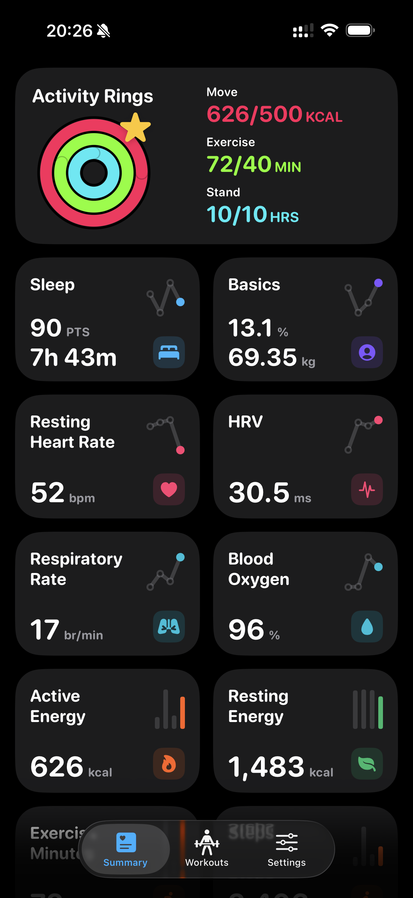
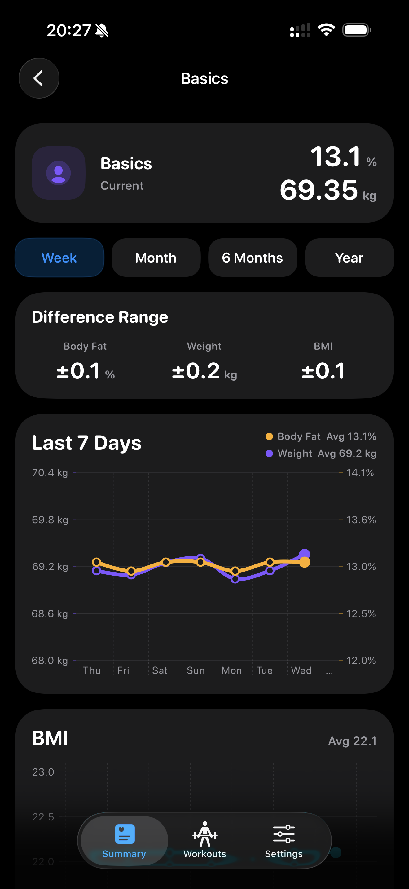
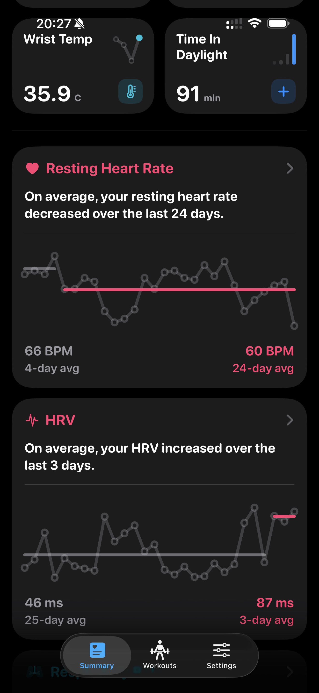
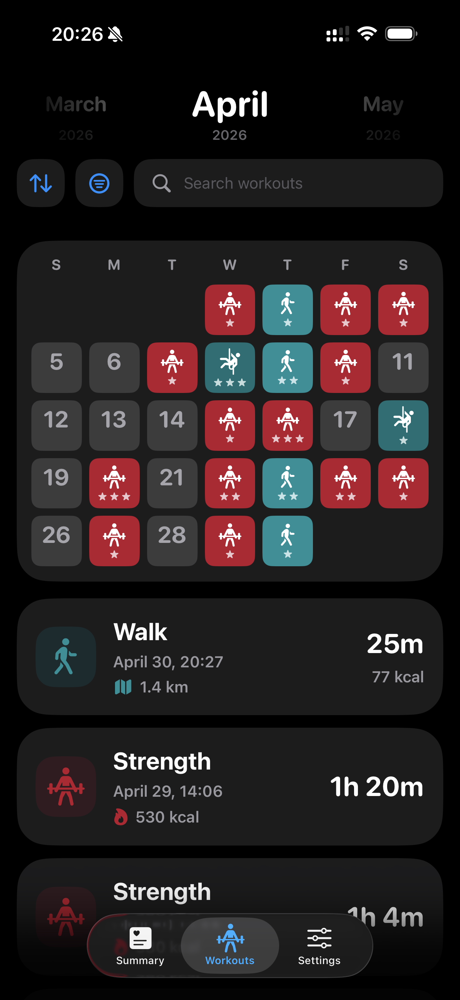
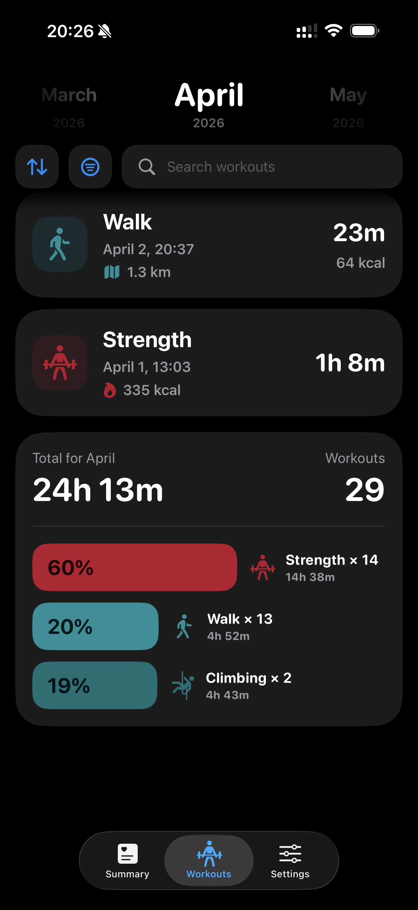

# Body

<p align="center">
  
</p>

Body is a privacy-focused iOS health visualization app built with SwiftUI. It turns Apple Health workouts, Activity Rings, sleep, energy, body measurements, daylight, steps, and vitals into a local-first app and widget experience.

The app shell follows Coin's simple tab structure: Summary handles health cards and recent trends, Workouts provides searchable workout history plus monthly workout visualizations, and Settings handles appearance and app details.

Current app version: **0.3.4 (build 1)**

## Screenshots

<p align="center">
  
  
  
</p>

<p align="center">
  
  
  
</p>

## Current Scope

- **Workout calendar widget** - The large widget shows workout days for the current month with screenshot-style rounded square calendar tiles.
- **Workout types widget** - A second large-only widget shows monthly workout time by type with a Coin-style percentage-bar breakdown.
- **Widget appearance** - Widgets include Coin-style background choices for System, Black, and White.
- **Workout markers** - Workout days replace the date number with the Apple/SF workout icon in a solid color for the specific Apple Health workout type. If a day has multiple workouts, Body shows the longest-duration workout.
- **Count indicators** - Workout-day tiles keep Coin's count markers: stars count as 1, moons count as 4, and 13 or more workouts shows a sun.
- **Apple Health sync** - The app requests read-only access to workouts, activity rings, sleep, heart, body measurement, energy, daylight, steps, exercise-minute, and wrist-temperature data; workout summaries are also written for widgets through an App Group.
- **Summary health cards** - Summary shows a two-card-wide Activity Rings summary above Exercise Minutes, Wrist Temperature, Time In Daylight, Steps, Sleep, Basics, resting heart rate, HRV, blood oxygen, respiratory rate, active energy, and resting energy cards. Each small card includes a recent four-day preview chart, using bars for bar-chart detail pages and lines for line-chart detail pages.
- **Activity Rings completion** - The Summary Activity Rings card mirrors the monthly rings view by showing a scaled gold star when all three rings are complete for today.
- **Health detail ranges** - Detail screens open Week charts by default and include Week, Month, 6 Months, and Year range buttons. Line charts use colored lines and hollow point markers across all ranges, with Month, 6 Months, and Year capped to reduce visual noise. Long-range charts aggregate nearby days before rendering.
- **Basics detail** - Basics shows equal-weight current body fat and weight values, then opens a timeframe-aware Difference Range card for Body Fat, Weight, and BMI above the dual-axis Weight and Body Fat chart and separate BMI chart.
- **Sleep detail** - Sleep details show today's sleep score, today's sleep-stage timeline, an Apple-style high/typical/low Sleep Vitals chart with sleep duration as the fifth metric, and the range trend chart at the bottom. The sleep score sheet opens at a height that shows the full scoring breakdown without pulling it to full screen.
- **Metric About cards** - Every Summary detail page includes an About card explaining the metric and its interpretation.
- **Workouts visualizations** - The in-app workout calendar appears above workout rows, and the workout type breakdown is merged with monthly summary totals at the bottom of Workouts. Both open workout list sheets when tapped.
- **Workouts tab** - A dedicated workout history surface supports month browsing, search, sort, type filters, summary totals, and workout detail sheets.
- **Coin-style settings** - The Settings tab includes Appearance choices, Units, icon selection, a Data > Permissions section for controlling which Apple Health categories Body may read in-app, and About rows for Copyright and Version.
- **Local-first widget bridge** - Widgets read a cached JSON snapshot from the app group's shared file container; they do not query HealthKit directly.
- **Preview seed data** - A May 2026 placeholder snapshot keeps the widget and app visually useful before HealthKit access is granted.

## Requirements

- iOS 18.0+
- Xcode 26.4+
- Swift 5 language mode
- Apple Health read permission

## Installation

1. Open `body.xcodeproj` in Xcode.
2. Select the `Body` scheme.
3. Build and run on an iPhone simulator or device.
4. On a real device, pull down on the Summary tab to refresh and grant Apple Health access.

## Project Structure

```text
Body/
├── Body/                  # SwiftUI app and HealthKit workout ingestion
├── BodyShared/            # Shared workout models, snapshot storage, and calendar UI
├── BodyWidgetExtension/   # WidgetKit calendar widget
├── BodyTests/             # Unit and configuration tests
└── body.xcodeproj/        # Xcode project and shared schemes
```

## Privacy

Body reads health data from Apple Health only after permission is granted. Users can also hide health categories inside Settings > Data > Permissions, which removes those categories from the in-app dashboard without changing system-level Apple Health authorization. Workout summaries are stored locally on device and mirrored to the widget through the app group's shared `UserDefaults`. Body does not collect tracking data.

## Documentation

- [LessonsLearned.md](LessonsLearned.md) captures project-specific implementation notes and gotchas.
- [TestPlan.md](TestPlan.md) tracks the current app and widget test plan.
- [VersionHistory.md](VersionHistory.md) records release notes.

## License

Body is source-available, not open source. The code is public for transparency and personal, non-commercial evaluation/reference only. Commercial use, redistribution, App Store/TestFlight/enterprise distribution, derivative app publishing, sublicensing, and reuse of Body branding/assets are prohibited without prior written permission.

See [LICENSE](LICENSE) for the full Body Source-Available License. Third-party and upstream notices are summarized in [THIRD_PARTY_NOTICES.md](THIRD_PARTY_NOTICES.md).
